---
## Front matter
title: "Шаблон отчёта по лабораторной работе 1"
subtitle: "Операционные системы"
author: "Кализая Арсе Кхари Жекка"

## Generic otions
lang: ru-RU
toc-title: "Содержание"

## Bibliography
bibliography: bib/cite.bib
csl: pandoc/csl/gost-r-7-0-5-2008-numeric.csl

## Pdf output format
toc: true # Table of contents
toc-depth: 2
lof: true # List of figures
lot: true # List of tables
fontsize: 12pt
linestretch: 1.5
papersize: a4
documentclass: scrreprt
## I18n polyglossia
polyglossia-lang:
  name: russian
  options:
	- spelling=modern
	- babelshorthands=true
polyglossia-otherlangs:
  name: english
## I18n babel
babel-lang: russian
babel-otherlangs: english
## Fonts
mainfont: PT Serif
romanfont: PT Serif
sansfont: PT Sans
monofont: PT Mono
mainfontoptions: Ligatures=TeX
romanfontoptions: Ligatures=TeX
sansfontoptions: Ligatures=TeX,Scale=MatchLowercase
monofontoptions: Scale=MatchLowercase,Scale=0.9
## Biblatex
biblatex: true
biblio-style: "gost-numeric"
biblatexoptions:
  - parentracker=true
  - backend=biber
  - hyperref=auto
  - language=auto
  - autolang=other*
  - citestyle=gost-numeric
## Pandoc-crossref LaTeX customization
figureTitle: "Рис."
tableTitle: "Таблица"
listingTitle: "Листинг"
lofTitle: "Список иллюстраций"
lotTitle: "Список таблиц"
lolTitle: "Листинги"
## Misc options
indent: true
header-includes:
  - \usepackage{indentfirst}
  - \usepackage{float} # keep figures where there are in the text
  - \floatplacement{figure}{H} # keep figures where there are in the text
---

# Цель работы

Целью данной работы является приобретение практических навыков установки операционной системы на виртуальную машину, настройки минимально необходимых для дальнейшей работы сервисов.

# Задание

установить на виртуальной машине операционную систему Linux(Fedora) и пакеты.

# Теоретическое введение

более подробно про Unix см. в [@tanenbaum_book_modern-os_ru; @robbins_book_bash_en; @zarrelli_book_mastering-bash_en; @newham_book_learning-bash_en].
   
# Выполнение лабораторной работы

у меня уже уставлена операционная система Linux в виртуальной машине, поэтому я прыгнул на часть После установки. я использовал команду sudo -i чтобы переключаться на роль супер-пользователя (рис. [-@fig:001]).

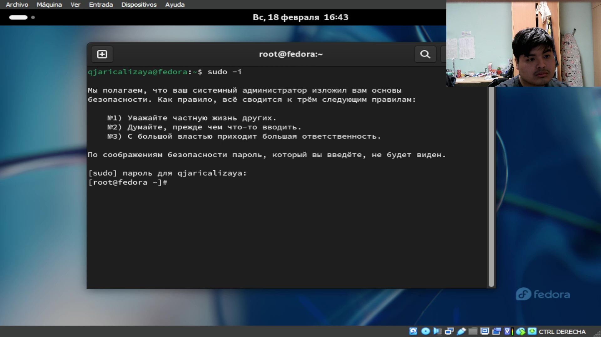{#fig:001 width=70%}

Потом я обновил все пакеты вводя команду dnf -y update (рис. [-@fig:002]).

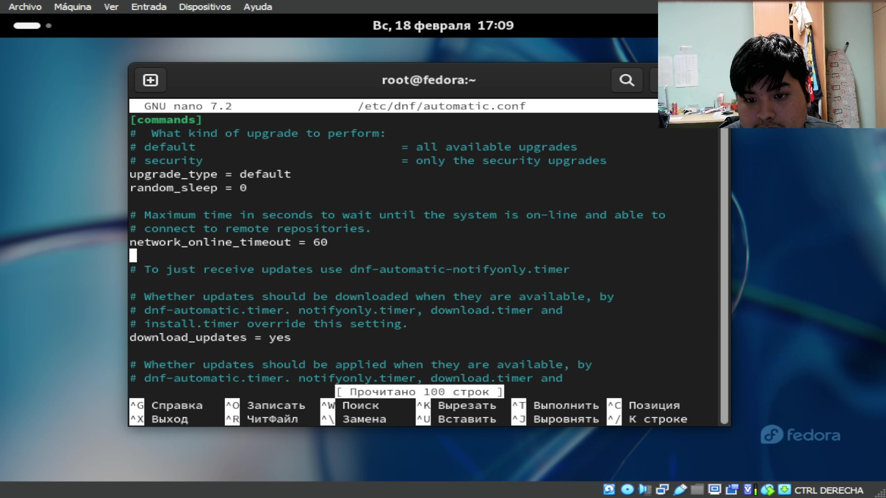{#fig:002 width=70%}

Потом я написал команду dnf -y install tmux mc для удобства работы в консоли (рис. [-@fig:003])

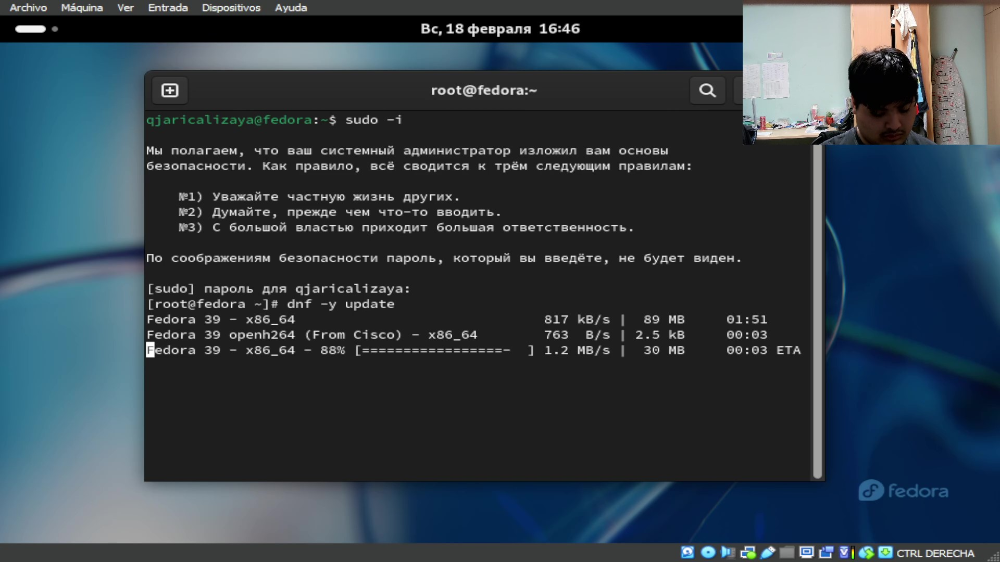{#fig:003 width=70%}

Дальше я установил программное обеспечение для автоматического обновления вводя команду dnf install dnf-automatic (рис. [-@fig:004]).

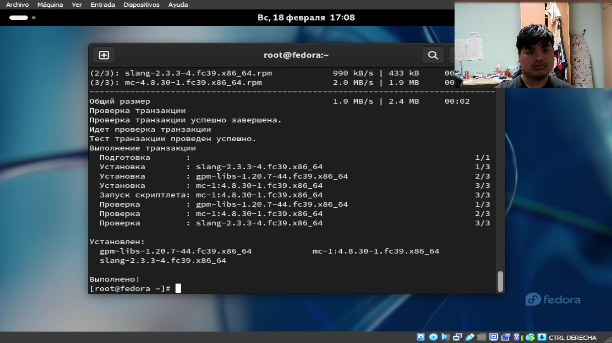{#fig:004 width=70%}

Потом с помощью редактора nano я открыл файл конфигурации automatic.conf, но в этом случае я не изменял ничего (рис. [-@fig:005]).

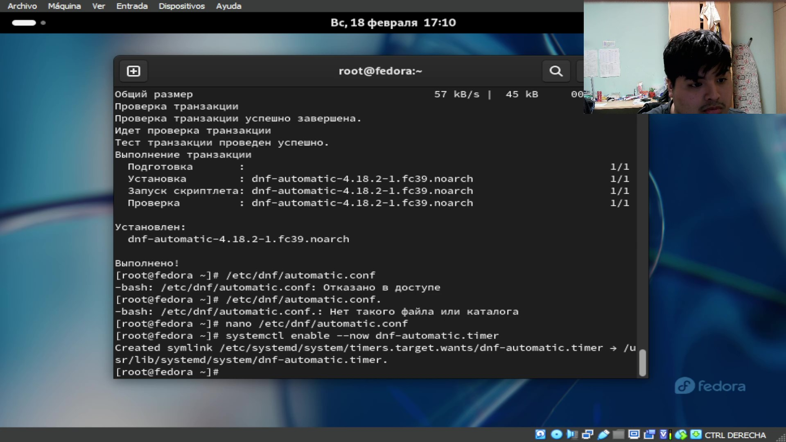{#fig:005 width=70%}

Потом ввел команду systemctl enable --now dnf-automatic.timer чтобы запустить таймер.

Мы не будем рассматривать работу с системной безопасности Selinux, поэтому я отключил его с помощью редактора nano для открывания файла конфигурации находящего в каталоге /etc/selinux/config. Мне надо было переписать несколькие строки как видно в (рис. [-@fig:006.1]) и (рис. [-@fig:006.2]).

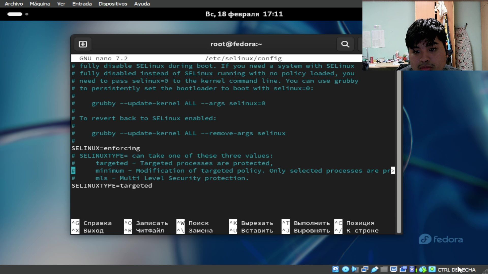{#fig:006.1 width=70%}

{#fig:006.2 width=70%}

Потом я установил драйверы для виртуальной машины. Сначала я написал команду tmux потом sudo -i для правильной работы команд. потом я установил Development Tools вводя команду dnf -f group install Development Tools (рис. [-@fig:007]). 

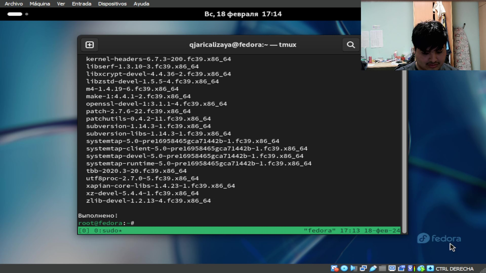{#fig:007 width=70%}

Потом я установил пакеты DKMS с командой "dnf -y install dkms" (рис. [-@fig:008]).

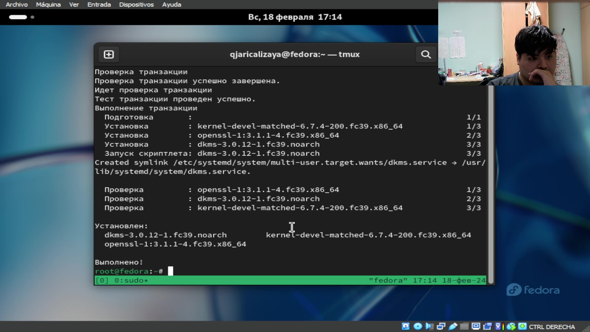{#fig:008 width=70%}

Затем я включил диск дополнений гостевой ОС и подмонтировал его в каталоге /media (рис. [-@fig:009]).

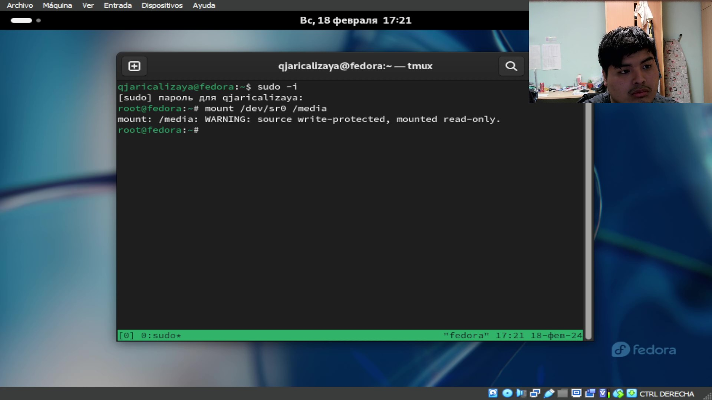{#fig:009 width=70%}

И установил драйверы с помощью команды /media/VBoxLinuxAdditions.run (рис. [-@fig:010]).

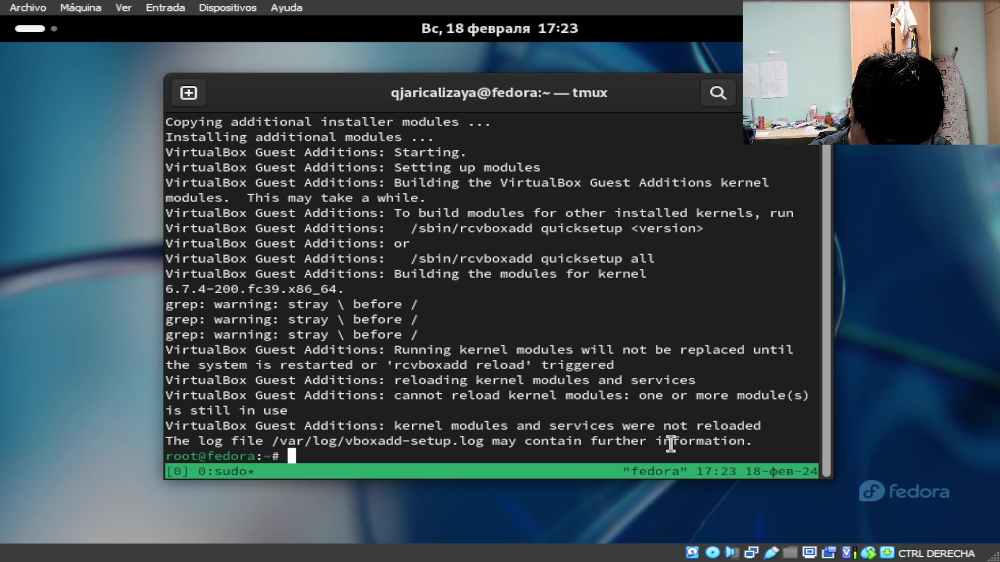{#fig:010 width=70%}

Потом я перегрузил виртуальную машину.

в моем случае моё имя соответствует на мой аккаунт и имя в терминале 

потом я установил программное обеспечение для создания документации. я написал команду dnf -y install pandoc потом я скачал две папки с программами и поставил в каталоге /usr/local/bin.(рис. [-@fig:011.X]). 

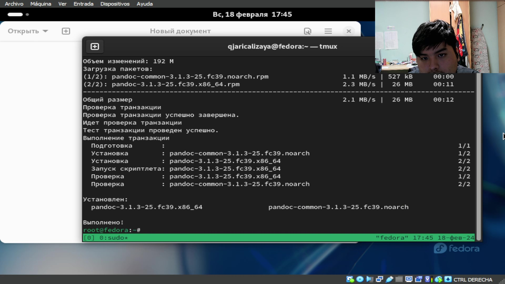{#fig:011.1 width=70%}

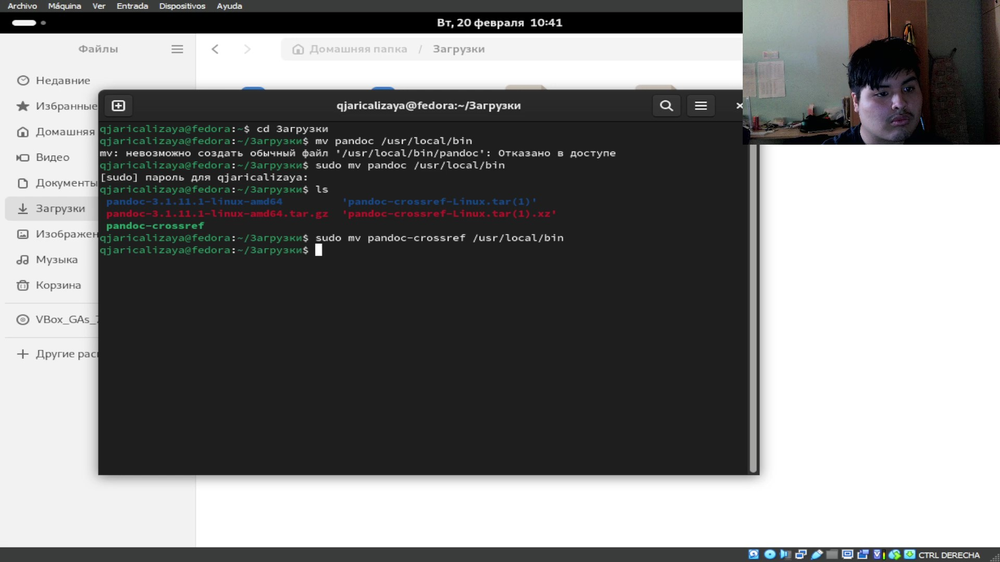{#fig:011.2 width=70%}

Последный шаг было установление дистрибутив TeXlive. я написал команду dnf -y install texlive-scheme-full и ждал. в этом случае время для установления было длинным.(рис. [-@fig:012]).

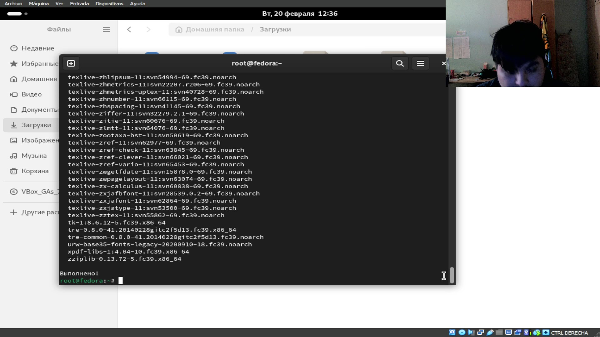{#fig:012 width=70%}

Для решения домашнего задания я использовал две команды dmesg | less и dmesg | grep -i то, что ищем и нашел всю запрашиваемую информацию (рис. [-@fig:013.Х]).

{#fig:013.1 width=70%}

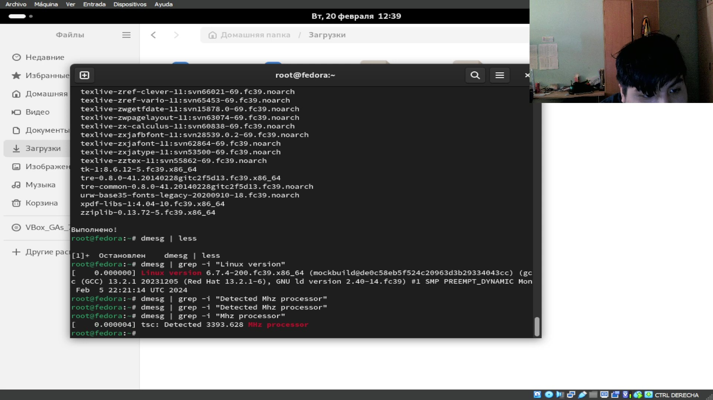{#fig:013.2 width=70%}

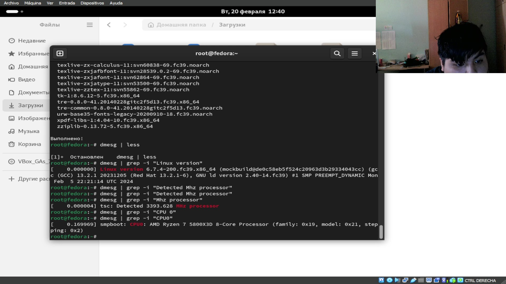{#fig:013.3 width=70%}

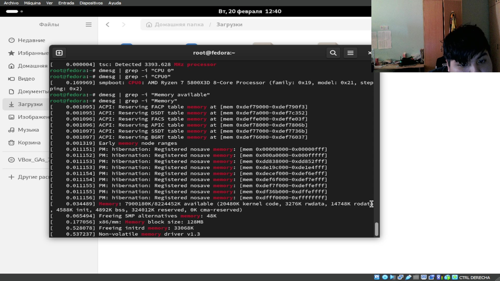{#fig:013.4 width=70%}

{#fig:013.5 width=70%}

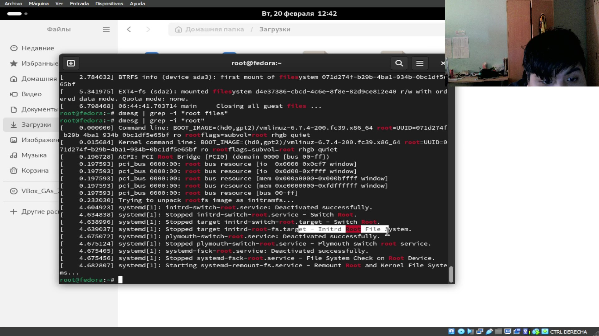{#fig:013.6 width=70%}

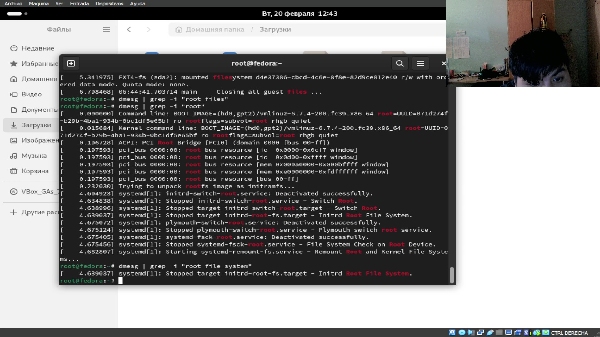{#fig:013.7 width=70%}

# Выводы

В этой лабораторной работе я смотрел процесс установки операционной системы и другие дополнения для корректной и удобной работы. 

# Список литературы{.unnumbered}

1. Dash, P. Getting Started with Oracle VM VirtualBox / P. Dash. – Packt Publishing Ltd, 2013. – 86 сс.
2. Colvin, H. VirtualBox: An Ultimate Guide Book on Virtualization with VirtualBox. VirtualBox / H. Colvin. – CreateSpace Independent Publishing Platform 2015. – 70 сс.
3. Vugt, S. van. Red Hat RHCSA/RHCE 7 cert guide : Red Hat Enterprise Linux 7 (EX200 and EX300) : Certification Guide. Red Hat RHCSA/RHCE 7 cert guide / S. van Vugt. – Pearson IT Certification, 2016. – 1008 сс.
4. Робачевский, А. Операционная система UNIX / А. Робачевский, С. Немнюгин, О. Стесик. – 2-е изд. – Санкт-Петербург : БХВ-Петербург, 2010. – 656 сс.
5. Немет, Э. Unix и Linux: руководство системного администратора. Unix и Linux / Э. Немет, Г. Снайдер, Т.Р. Хейн, Б. Уэйли. – 4-е изд. – Вильямс, 2014. – 1312 сс.
6. Колисниченко, Д.Н. Самоучитель системного администратора Linux : Системный администратор / Д.Н. Колисниченко. – Санкт-Петербург : БХВ-Петербург, 2011. – 544 сс.
7. Robbins, A. Bash Pocket Reference / A. Robbins. – O’Reilly Media, 2016. – 156 сс.

::: {#refs}
:::
