---
## Front matter
title: "Шаблон отчёта по лабораторной работе"
subtitle: "Простейший вариант"
author: "Дмитрий Сергеевич Кулябов"

## Generic otions
lang: ru-RU
toc-title: "Содержание"

## Bibliography
bibliography: bib/cite.bib
csl: pandoc/csl/gost-r-7-0-5-2008-numeric.csl

## Pdf output format
toc: true # Table of contents
toc-depth: 2
lof: true # List of figures
lot: true # List of tables
fontsize: 12pt
linestretch: 1.5
papersize: a4
documentclass: scrreprt
## I18n polyglossia
polyglossia-lang:
  name: russian
  options:
	- spelling=modern
	- babelshorthands=true
polyglossia-otherlangs:
  name: english
## I18n babel
babel-lang: russian
babel-otherlangs: english
## Fonts
mainfont: PT Serif
romanfont: PT Serif
sansfont: PT Sans
monofont: PT Mono
mainfontoptions: Ligatures=TeX
romanfontoptions: Ligatures=TeX
sansfontoptions: Ligatures=TeX,Scale=MatchLowercase
monofontoptions: Scale=MatchLowercase,Scale=0.9
## Biblatex
biblatex: true
biblio-style: "gost-numeric"
biblatexoptions:
  - parentracker=true
  - backend=biber
  - hyperref=auto
  - language=auto
  - autolang=other*
  - citestyle=gost-numeric
## Pandoc-crossref LaTeX customization
figureTitle: "Рис."
tableTitle: "Таблица"
listingTitle: "Листинг"
lofTitle: "Список иллюстраций"
lotTitle: "Список таблиц"
lolTitle: "Листинги"
## Misc options
indent: true
header-includes:
  - \usepackage{indentfirst}
  - \usepackage{float} # keep figures where there are in the text
  - \floatplacement{figure}{H} # keep figures where there are in the text
---

# Цель работы

Изучить идеологию и применение средств контроля версий освоить умения по работе с git.

# Задание

Настройка git в виртуальной машине и соединять его с персональным аккаунтом. 

# Теоретическое введение

## Системы контроля версий. Общие понятия:

Системы контроля версий (Version Control System, VCS) применяются при работе нескольких человек над одним проектом. Обычно основное дерево проекта хранится в локальном или удалённом репозитории, к которому настроен доступ для участников проекта. При внесении изменений в содержание проекта система контроля версий позволяет их фиксировать, совмещать изменения, произведённые разными участниками проекта, производить откат к любой более ранней версии проекта, если это требуется.

В классических системах контроля версий используется централизованная модель, предполагающая наличие единого репозитория для хранения файлов. Выполнение большинства функций по управлению версиями осуществляется специальным сервером. Участник проекта (пользователь) перед началом работы посредством определённых команд получает нужную ему версию файлов. После внесения изменений, пользователь размещает новую версию в хранилище. При этом предыдущие версии не удаляются из центрального хранилища и к ним можно вернуться в любой момент. Сервер может сохранять не полную версию изменённых файлов, а производить так называемую дельта-компрессию — сохранять только изменения между последовательными версиями, что позволяет уменьшить объём хранимых данных.

Системы контроля версий поддерживают возможность отслеживания и разрешения конфликтов, которые могут возникнуть при работе нескольких человек над одним файлом. Можно объединить (слить) изменения, сделанные разными участниками (автоматически или вручную), вручную выбрать нужную версию, отменить изменения вовсе или заблокировать файлы для изменения. В зависимости от настроек блокировка не позволяет другим пользователям получить рабочую копию или препятствует изменению рабочей копии файла средствами файловой системы ОС, обеспечивая таким образом, привилегированный доступ только одному пользователю, работающему с файлом.

Системы контроля версий также могут обеспечивать дополнительные, более гибкие функциональные возможности. Например, они могут поддерживать работу с несколькими версиями одного файла, сохраняя общую историю изменений до точки ветвления версий и собственные истории изменений каждой ветви. Кроме того, обычно доступна информация о том, кто из участников, когда и какие изменения вносил. Обычно такого рода информация хранится в журнале изменений, доступ к которому можно ограничить.

В отличие от классических, в распределённых системах контроля версий центральный репозиторий не является обязательным.

Среди классических VCS наиболее известны CVS, Subversion, а среди распределённых — Git, Bazaar, Mercurial. Принципы их работы схожи, отличаются они в основном синтаксисом используемых в работе команд.

## Примеры использования git

- Система контроля версий Git представляет собой набор программ командной строки. Доступ к ним можно получить из терминала посредством ввода команды git с различными опциями.
- Благодаря тому, что Git является распределённой системой контроля версий, резервную копию локального хранилища можно сделать простым копированием или архивацией.

## Основные команды git

- Перечислим наиболее часто используемые команды git.

- Создание основного дерева репозитория:
    git init

- Получение обновлений (изменений) текущего дерева из центрального репозитория:
    git pull

- Отправка всех произведённых изменений локального дерева в центральный репозиторий:
    git push

- Просмотр списка изменённых файлов в текущей директории:
    git status

- Просмотр текущих изменений:
    git diff
    
- Сохранение текущих изменений:

    - добавить все изменённые и/или созданные файлы и/или каталоги:
        git add .

    - добавить конкретные изменённые и/или созданные файлы и/или каталоги:
        git add имена_файлов

    - удалить файл и/или каталог из индекса репозитория (при этом файл и/или каталог остаётся в локальной директории):
        git rm имена_файлов
    
    
- Сохранение добавленных изменений:

    - сохранить все добавленные изменения и все изменённые файлы:
        git commit -am 'Описание коммита'

    - сохранить добавленные изменения с внесением комментария через встроенный редактор:

        git commit

    - создание новой ветки, базирующейся на текущей:

        git checkout -b имя_ветки

    - переключение на некоторую ветку:

        git checkout имя_ветки

    -(при переключении на ветку, которой ещё нет в локальном репозитории, она будет создана и связана с удалённой)

    - отправка изменений конкретной ветки в центральный репозиторий:

        git push origin имя_ветки

    - слияние ветки с текущим деревом:

        git merge --no-ff имя_ветки
        
- Удаление ветки:

    - удаление локальной уже слитой с основным деревом ветки:

        git branch -d имя_ветки

    - принудительное удаление локальной ветки:

        git branch -D имя_ветки

    - удаление ветки с центрального репозитория:

        git push origin :имя_ветки

## Стандартные процедуры работы при наличии центрального репозитория

- Работа пользователя со своей веткой начинается с проверки и получения изменений из центрального репозитория (при этом в локальное дерево до начала этой процедуры не должно было вноситься изменений):

        git checkout master
        git pull
        git checkout -b имя_ветки

- Затем можно вносить изменения в локальном дереве и/или ветке.

- После завершения внесения какого-то изменения в файлы и/или каталоги проекта необходимо разместить их в центральном репозитории. Для этого необходимо проверить, какие файлы изменились к текущему моменту:

        git status

- При необходимости удаляем лишние файлы, которые не хотим отправлять в центральный репозиторий.

- Затем полезно просмотреть текст изменений на предмет соответствия правилам ведения чистых коммитов:

        git diff

- Если какие-либо файлы не должны попасть в коммит, то помечаем только те файлы, изменения которых нужно сохранить. Для этого используем команды добавления и/или удаления с нужными опциями:

        git add …  
        git rm …

- Eсли нужно сохранить все изменения в текущем каталоге, то используем:

        git add .

- Затем сохраняем изменения, поясняя, что было сделано:

        git commit -am "Some commit message"

- Отправляем изменения в центральный репозиторий:

        git push origin имя_ветки

или

        git push

##Работа с локальным репозиторием

- Создадим локальный репозиторий.

- Сначала сделаем предварительную конфигурацию, указав имя и email владельца репозитория:

        git config --global user.name "Имя Фамилия"
        git config --global  user.email "work@mail"

- Настроим utf-8 в выводе сообщений git:

        git config --global quotepath false

- Для инициализации локального репозитория, расположенного, например, в каталоге ~/tutorial, необходимо ввести в командной строке:

        cd 
        mkdir tutorial
        cd tutorial
        git init

- После это в каталоге tutorial появится каталог .git, в котором будет храниться история изменений.

- Создадим тестовый текстовый файл hello.txt и добавим его в локальный репозиторий:

        echo 'hello world' > hello.txt
        git add hello.txt
        git commit -am 'Новый файл'

- Воспользуемся командой status для просмотра изменений в рабочем каталоге, сделанных с момента последней ревизии:

        git status

- Во время работы над проектом так или иначе могут создаваться файлы, которые не требуется добавлять в последствии в репозиторий. Например, временные файлы, создаваемые редакторами, или объектные файлы, создаваемые компиляторами. Можно прописать шаблоны игнорируемых при добавлении в репозиторий типов файлов в файл .gitignore с помощью сервисов. Для этого сначала нужно получить список имеющихся шаблонов:

        curl -L -s https://www.gitignore.io/api/list

- Затем скачать шаблон, например, для C и C++

        curl -L -s https://www.gitignore.io/api/c >> .gitignore
        curl -L -s https://www.gitignore.io/api/c++ >> .gitignore

##Работа с сервером репозиториев

- Для последующей идентификации пользователя на сервере репозиториев необходимо сгенерировать пару ключей (приватный и открытый):

        ssh-keygen -C "Имя Фамилия <work@mail>"

- Ключи сохраняться в каталоге ~/.ssh/.
- Существует несколько доступных серверов репозиториев с возможностью бесплатного размещения данных. Например, https://github.com/.
- Для работы с ним необходимо сначала завести на сайте https://github.com/ учётную запись. Затем необходимо загрузить сгенерённый нами ранее открытый ключ.
- Для этого зайти на сайт https://github.com/ под своей учётной записью и перейти в меню GitHub setting.

- После этого выбрать в боковом меню GitHub setting>SSH-ключи и нажать кнопку Добавить ключ. Скопировав из локальной консоли ключ в буфер обмена:

        cat ~/.ssh/id_rsa.pub | xclip -sel clip

- Вставляем ключ в появившееся на сайте поле.

- После этого можно создать на сайте репозиторий, выбрав в меню , дать ему название и сделать общедоступным (публичным).

- Для загрузки репозитория из локального каталога на сервер выполняем следующие команды:

        git remote add origin 
        ssh://git@github.com/<username>/<reponame>.git
        git push -u origin master

- Далее на локальном компьютере можно выполнять стандартные процедуры для работы с git при наличии центрального репозитория.

##Базовая настройка git

###Первичная настройка параметров git

- Зададим имя и email владельца репозитория:

        git config --global user.name "Name Surname"
        git config --global user.email "work@mail"

- Настроим utf-8 в выводе сообщений git:

        git config --global core.quotepath false

- Настройте верификацию и подписание коммитов git.

- Зададим имя начальной ветки (будем называть её master):

        git config --global init.defaultBranch master

###Учёт переносов строк

- В разных операционных системах приняты разные символы для перевода строк:
    - Windows: `\r\n (CR и LF);`
    - Unix: `\n (LF);`
    - Mac: `\r (CR).`
    
- Посмотреть значения переносов строк в репозитории можно командой:

        git ls-files --eol

    1. Параметр autocrlf
    - Настройка core.autocrlf предназначена для того, чтобы в главном репозитории все переводы строк текстовых файлах были одинаковы.
    - Настройка core.autocrlf с параметрами true и input делает все переводы строк текстовых файлов в главном репозитории одинаковыми.
      - core.autocrlf true: конвертация CRLF->LF при коммите и обратно LF->CRLF при выгрузке кода из репозитория на файловую систему (обычно используется в Windows).
      - core.autocrlf input: конвертация CRLF->LF только при коммитах (используются в MacOS/Linux).

    - Варианты конвертации

: Варианты конвертации для разных значений параметра core.autocrlf {#tbl:std-dir}

| core.autocrlf         | false         | input         | true          |
|-----------------------|---------------|---------------|---------------|
| git commit            | LF -> LF      | LF -> LF      | LF -> CRLF    |
|                       | CR -> CR      | CR -> CR      | CR -> CR      |
|                       | CRLF -> CRLF  | CRLF -> LF    | CRLF -> CRLF  |
| git checkout          | LF -> LF      | LF -> LF      | LF -> CRLF    |
|                       | CR -> CR      | CR -> CR      | CR -> CR      |
|                       | CRLF -> CRLF  | CRLF -> CRLF  | CRLF -> CRLF  |

    - Установка параметра:
    - Для Windows
            git config --global core.autocrlf true
    - Для Linux
            git config --global core.autocrlf input
            
    
    2. Параметр `safecrlf` 
    - Настройка `core.safecrlf` предназначена для проверки, является ли окончаний строк обратимым для текущей настрйки `core.autocrlf`.
     - core.safecrlf true: запрещается необратимое преобразование lf<->crlf. полезно, когда существуют бинарные файлы, похожие на текстовые файлы.
     - core.safecrlf warn: печать предупреждения, но коммиты с необратимым переходом принимаются.
    - Установка параметра:
        git config --global core.safecrlf warn
        
##Создание ключа ssh

###Общая информация

1. Алгоритмы шифрования ssh

    1. Аутентификация

    В SSH поддерживается четыре алгоритма аутентификации по открытым ключам:
     - DSA:
      - размер ключей DSA не может превышать 1024, его следует отключить;
     - RSA:
      - следует создавать ключ большого размера: 4096 бит;
     - ECDSA:
      - ECDSA завязан на технологиях NIST, его следует отключить;
     - Ed25519:
      - используется пока не везде.

    2. Симметричные шифры
     - Из 15 поддерживаемых в SSH алгоритмов симметричного шифрования, безопасными можно считать:
      - chacha20-poly1305;
      - aes*-ctr;
      - aes*-gcm.
     - Шифры 3des-cbc и arcfour потенциально уязвимы в силу использования DES и RC4.
     - Шифр cast128-cbc применяет слишком короткий размер блока (64 бит).

    3. Обмен ключами
     - Применяемые в SSH методы обмена ключей DH (Diffie-Hellman) и ECDH (Elliptic Curve Diffie-Hellman) можно считать безопасными.
     - Из 8 поддерживаемых в SSH протоколов обмена ключами вызывают подозрения три, основанные на рекомендациях NIST:
       - ecdh-sha2-nistp256;
       - ecdh-sha2-nistp384;
       - ecdh-sha2-nistp521.
     - Не стоит использовать протоколы, основанные на SHA1.

2. Файлы ssh-ключей

    - По умолчанию пользовательские ssh-ключи сохраняются в каталоге ~/.ssh в домашнем каталоге пользователя.
    - Убедитесь, что у вас ещё нет ключа.

    - Файлы закрытых ключей имеют названия типа id_<алгоритм> (например, id_dsa, id_rsa).

      - По умолчанию закрытые ключи имеют имена:

        id_dsa
        id_ecdsa
        id_ed25519
        id_rsa

    - Открытые ключи имеют дополнительные расширения .pub.

      - По умолчанию публичные ключи имеют имена:

        id_dsa.pub
        id_ecdsa.pub
        id_ed25519.pub
        id_rsa.pub

    - При создании ключа команда попросит ввести любую ключевую фразу для более надёжной защиты вашего пароля. Можно пропустить этот этап, нажав Enter.

    - Сменить пароль на ключ можно с помощью команды:

        ssh-keygen -p

###Создание ключа ssh

- Ключ ssh создаётся командой:

        ssh-keygen -t <алгоритм>

- Создайте ключи:

    - по алгоритму rsa с ключём размером 4096 бит:

    - ssh-keygen -t rsa -b 4096

    - по алгоритму ed25519:

    - ssh-keygen -t ed25519

- При создании ключа команда попросит ввести любую ключевую фразу для более надёжной защиты вашего пароля. Можно пропустить этот этап, нажав Enter.

- Сменить пароль на ключ можно с помощью команды:

        ssh-keygen -p

### Добавление SSH-ключа в учётную запись GitHub

- Скопируйте созданный SSH-ключ в буфер обмена командой:

        xclip -i < ~/.ssh/id_ed25519.pub

- Откройте настройки своего аккаунта на GitHub и перейдем в раздел SSH and GPC keys.
- Нажмите кнопку ew SSH key.
- Добавьте в поле Title название этого ключа, например, ed25519@hostname.
- Вставьте из буфера обмена в поле Key ключ.
- Нажмите кнопку Add SSH key.

## Верификация коммитов с помощью PGP

- Как настроить PGP-подпись коммитов с помощью gpg.

### Общая информация
- Коммиты имеют следующие свойства:
    - author (автор) — контрибьютор, выполнивший работу (указывается для справки);
    - committer (коммитер) — пользователь, который закоммитил изменения.
- Эти свойства можно переопределить при совершении коммита.
- Авторство коммита можно подделать.
- В git есть функция подписи коммитов.
- Для подписывания коммитов используется технология PGP (см. Работа с PGP).
- Подпись коммита позволяет удостовериться в том, кто является коммитером. Авторство не проверяется.

### Создание ключа
- Генерируем ключ

        gpg --full-generate-key

- Из предложенных опций выбираем:
    - тип RSA and RSA;
    - размер 4096;
    - выберите срок действия; значение по умолчанию — 0 (срок действия не истекает никогда).
- GPG запросит личную информацию, которая сохранится в ключе:
    - Имя (не менее 5 символов).
    - Адрес электронной почты.
      - При вводе email убедитесь, что он соответствует адресу, используемому на GitHub.
    - Комментарий. Можно ввести что угодно или нажать клавишу ввода, чтобы оставить это поле пустым.

###Экспорт ключа
- Выводим список ключей и копируем отпечаток приватного ключа:

        gpg --list-secret-keys --keyid-format LONG

- Отпечаток ключа — это последовательность байтов, используемая для идентификации более длинного, по сравнению с самим отпечатком ключа.

- Формат строки:

        sec   Алгоритм/Отпечаток_ключа Дата_создания [Флаги] [Годен_до]
          ID_ключа

- Экспортируем ключ в формате ASCII по его отпечатку:

        gpg --armor --export <PGP Fingerprint>
        

### Добавление PGP ключа в GitHub
    
- Копируем ключ и добавляем его в настройках профиля на GitHub (или GitLab).

- Cкопируйте ваш сгенерированный PGP ключ в буфер обмена:

        gpg --armor --export <PGP Fingerprint> | xclip -sel clip

- Перейдите в настройки GitHub (https://github.com/settings/keys), нажмите на кнопку New GPG key и вставьте полученный ключ в поле ввода.

### Подписывание коммитов git
- Подпись коммитов при работе через терминал:

        git commit -a -S -m 'your commit message'

- Флаг -S означает создание подписанного коммита. При этом может потребоваться ввод кодовой фразы, заданной при генерации GPG-ключа.

### Настройка автоматических подписей коммитов git
- Используя введёный email, укажите Git применять его при подписи коммитов:

        git config --global user.signingkey <PGP Fingerprint>
        git config --global commit.gpgsign true
        git config --global gpg.program $(which gpg2)

## Проверка коммитов в Git

- GitHub и GitLab будут показывать значок Verified рядом с вашими новыми коммитами.

### Режим бдительности (vigilant mode)
- На GitHub есть настройка vigilant mode.
- Все неподписанные коммиты будут явно помечены как Unverified.
- Включается это в настройках в разделе SSH and GPG keys. Установите метку на Flag unsigned commits as unverified.

Более подробно про Unix см. в [@tanenbaum_book_modern-os_ru; @robbins_book_bash_en; @zarrelli_book_mastering-bash_en; @newham_book_learning-bash_en].

# Выполнение лабораторной работы

Я начал эту лабораторую работу устанавливая программу git с помощью команды (рис. [-@fig:001]).
        dnf install git
        
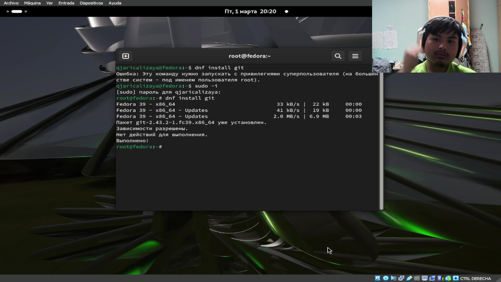{#fig:001 width=70%}

Потом я установил gh вводя команду (рис. [-@fig:002]).
        dnf install gh
        
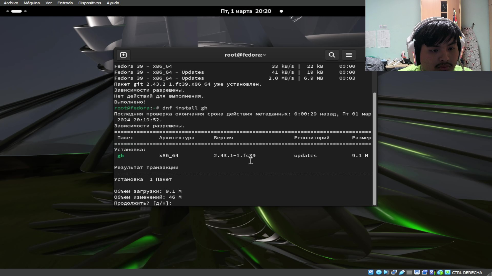{#fig:002 width=70%}

обе команды требовались разрешения супер-пользователя

Дальше я задал имя и email с командой (рис. [-@fig:003]).

        git config --global user.name "qjari shekka calizaya arce"
        git config --global user.email "1032234412@pfur.ru"
        
и настроил utf-8 с командой (рис. [-@fig:003]).
        git config --global core.quotepath false
        
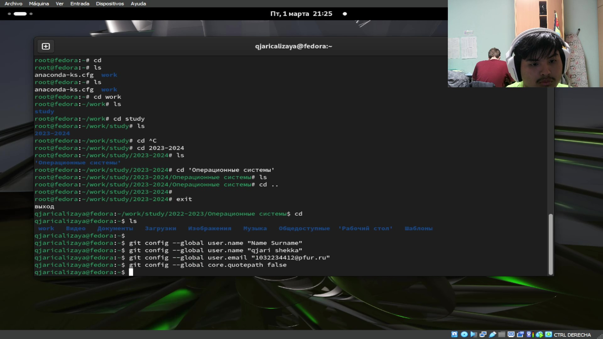{#fig:003 width=70%}
        
        

Затем я задал имя начальной ветки и назвал её master (рис. [-@fig:004]).
        git config --global init.defaulBrach master
 
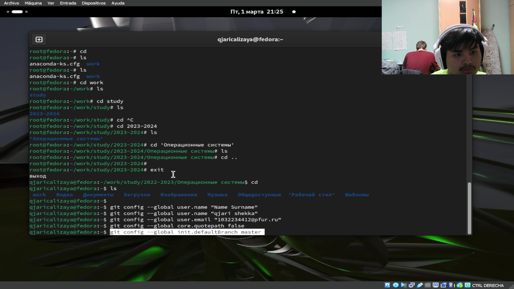{#fig:004 width=70%}

Потом настроил параметры autocrlf и safecrlf (рис. [-@fig:005]) с командами:
        git config --gloabl core.autocrlf input
        git config -- global core.safecrlf warn
        
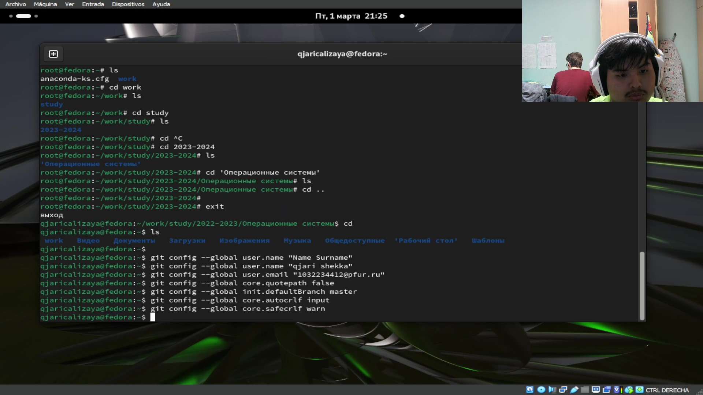{#fig:005 width=70%}
        
        
Теперь я создал ключ *SSH*, который я настроил с размером 4096 бит и по алгоритму ed25519 (рис. [-@fig:006]) (рис. [-@fig:007]) вводя в термале команды:

        ssh-keygen -t rsa -b 4096
        ssh-keygen -t ed25519

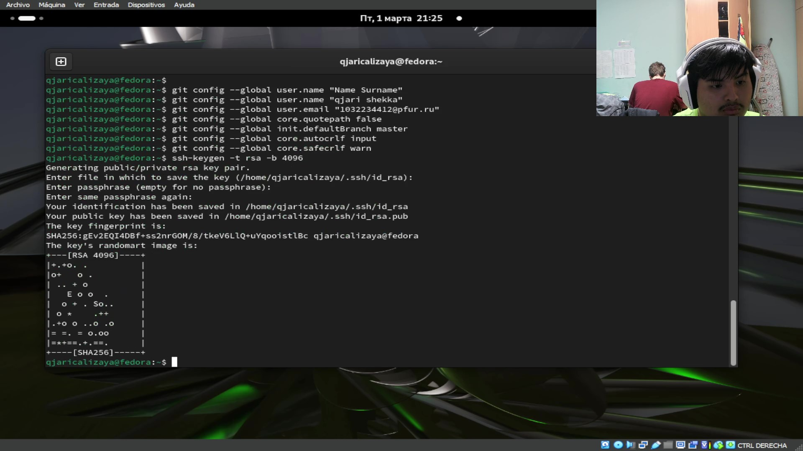{#fig:006 width=70%}

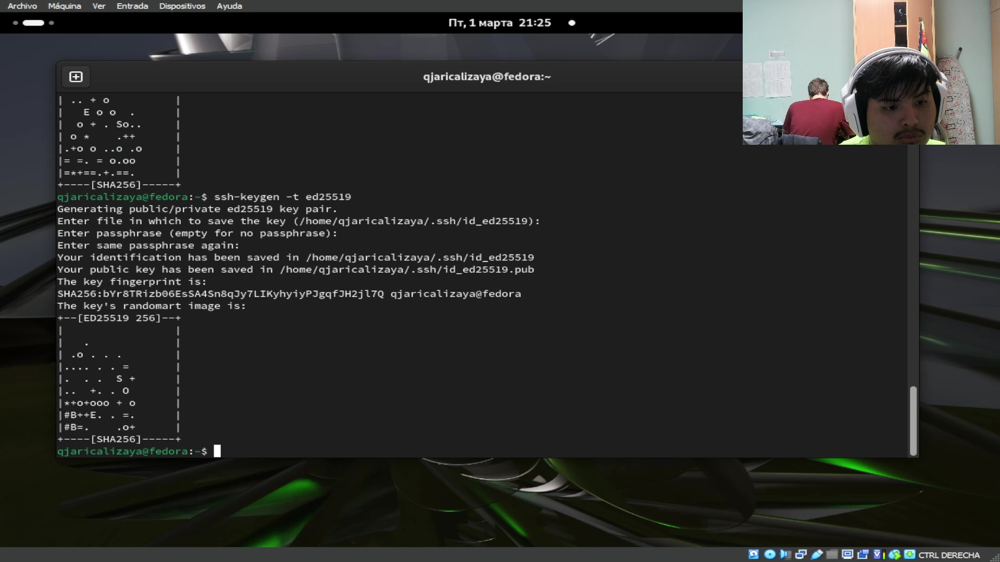{#fig:007 width=70%}

и генерировал ключ *pgp* (рис. [-@fig:008]) с помощью команды:

    gpg --full-generate-key

и настроил его с опцией тип *RSA and RSA* размер 4096 и значение по умольчанию-0

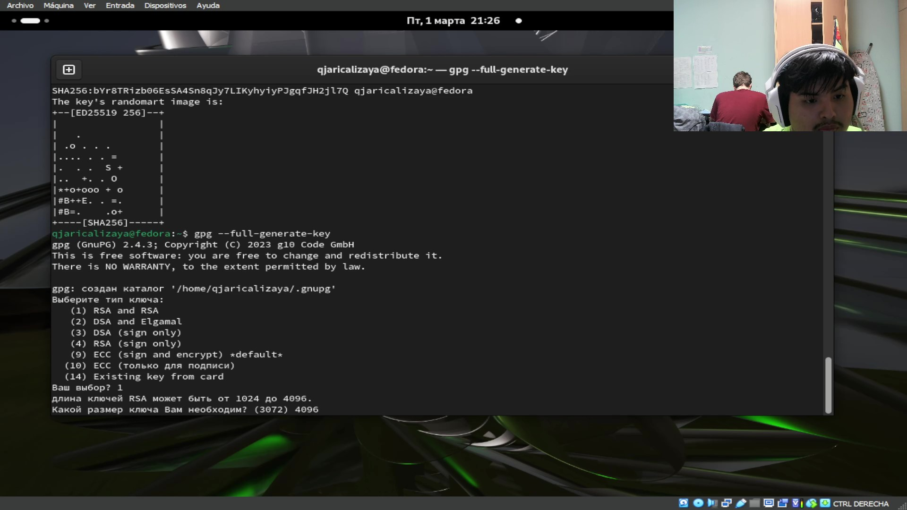{#fig:008 width=70%}

потом я задал имя и адрес электронной почты и в комментарии я не задал ничего (рис. [-@fig:009]).

{#fig:009 width=70%}

У меня уже аккаунт в github.com поэтому я не создал другое

Потом я добавил pgp ключ в github. для этого сначала я доказал firgerprint (рис. [-@fig:010]) с командой
    
        gpg --list-secret-keys --keyid-format LONG
        
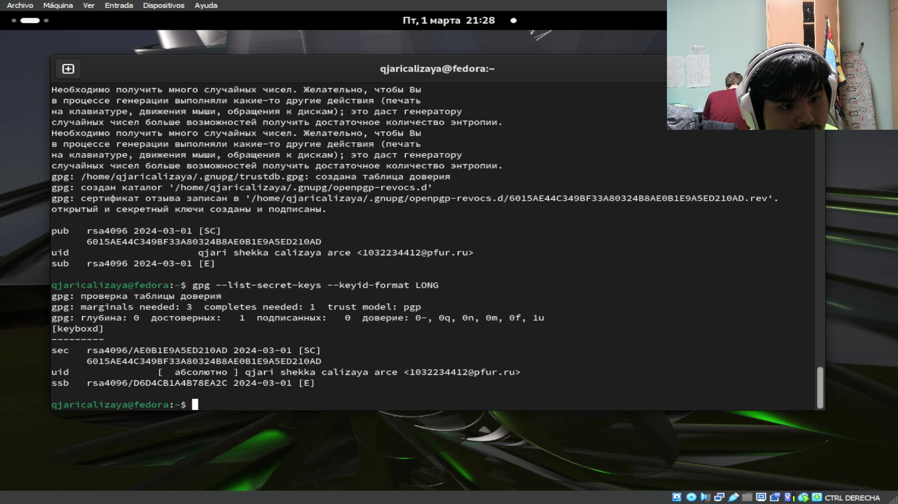{#fig:010 width=70%}
        
и поставил его в команде: (рис. [-@fig:011]).

        gpg --armor --export AE0B1E9ASED210AD | xclip -sel clip

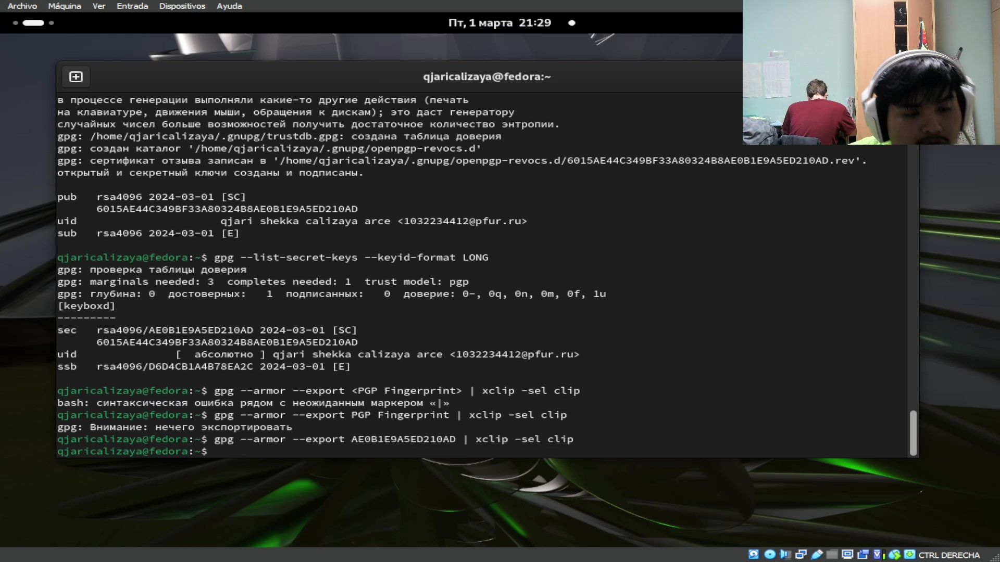{#fig:011 width=70%}

Копируя это ключ, я поставил в аккаунте github (рис. [-@fig:012]).

{#fig:012 width=70%}

Потом я вводил следующие команды:

        git config --global user.signingkey <PGP Fingerprint>
        git config --global commit.gpgsign true
        git config --global gpg.program $(which gpg2)

они настроят автоматических подписей коммитов git (рис. [-@fig:013]).

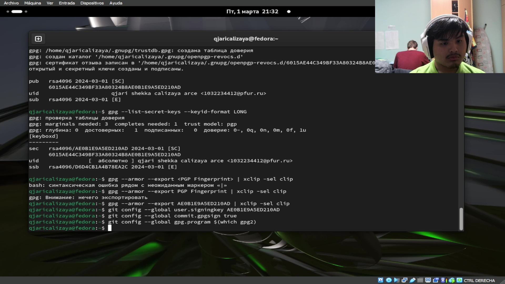{#fig:013 width=70%}

Дальше я настроил gh (рис. [-@fig:014]) с командой 

    gh auth login
    
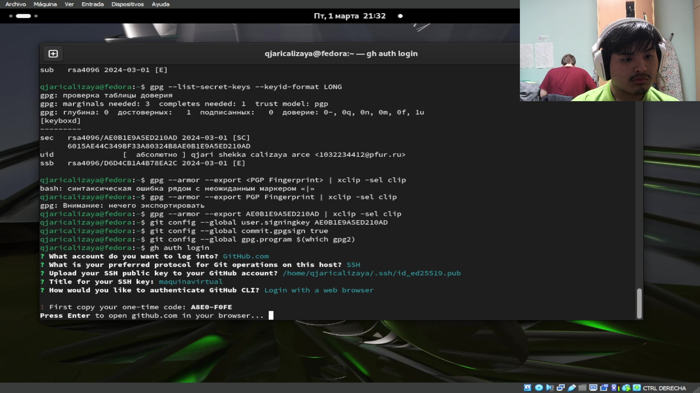{#fig:014 width=70%}

копировал код и открылся browser и там поставил код (рис. [-@fig:015]).

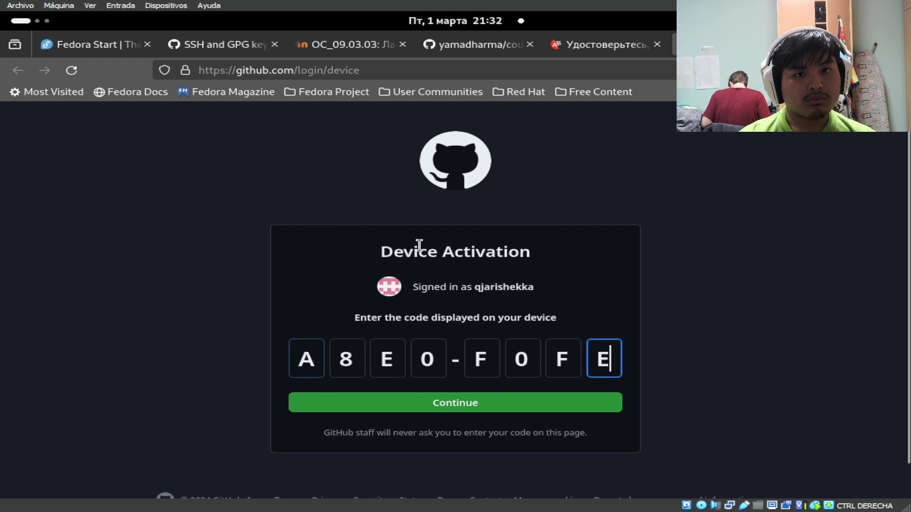{#fig:015 width=70%}

С следующими командами я создал рабочее пространство (рис. [-@fig:016]).

        mkdir -p ~/work/study/2022-2023/"Операционные системы"
        cd ~/work/study/2022-2023/"Операционные системы"
        gh repo create study_2022-2023_os-intro --template=yamadharma/course-directory-student-template --public
        git clone --recursive git@github.com:<owner>/study_2022-2023_os-intro.git os-intro

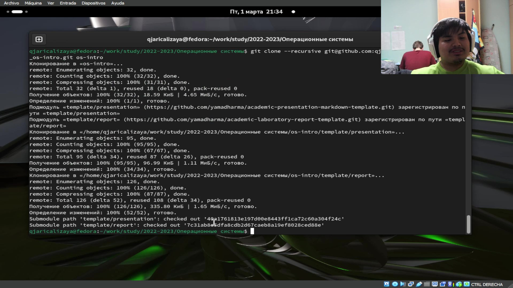{#fig:016 width=70%}

Потом я двигался в каталог cd ~/work/study/2022-2023/"Операционные системы"/os-intro и удалил файл package.json (рис. [-@fig:017]).
        
            rm package.json

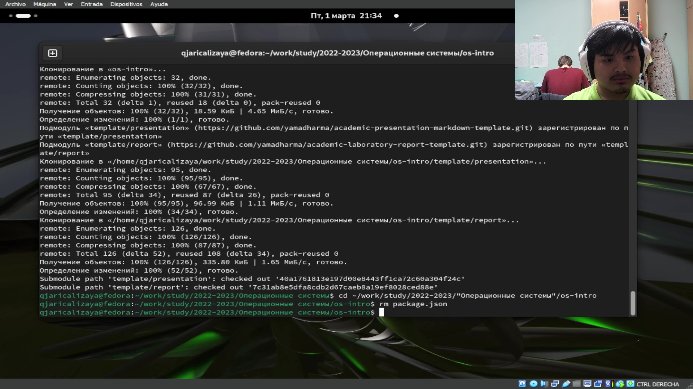{#fig:017 width=70%}

дальше я создал необходимые каталоги (рис. [-@fig:018]).

        echo os-intro > COURSE
        make

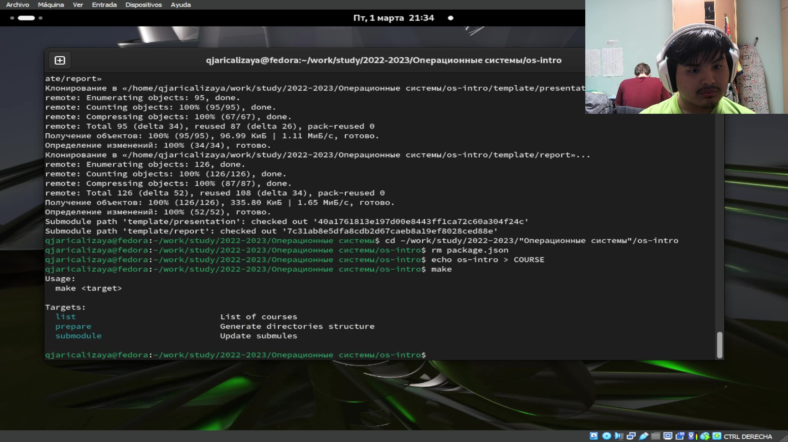{#fig:018 width=70%}

И отправил их на сервер (рис. [-@fig:019]).

        git add .
        git commit -am 'feat(main): make course structure'
        git push

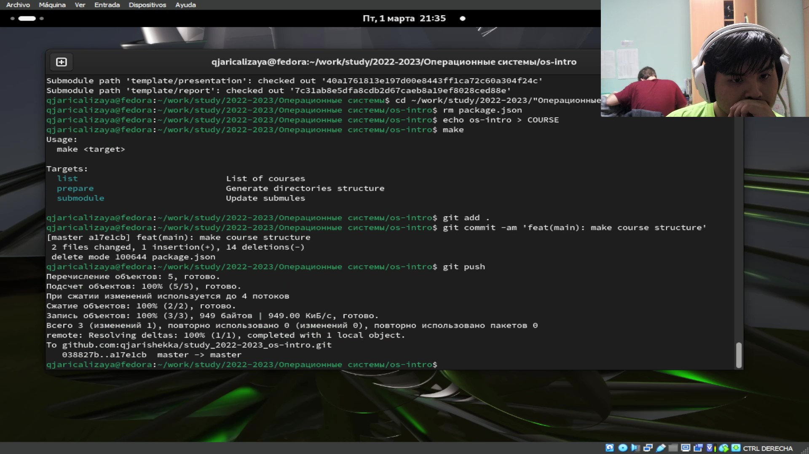{#fig:019 width=70%}

# Выводы

В отличие последнего раз я использовал другой ключ для соединения с сервером github, который более безопасный. Также процесс создания ключа разный и сложнее.

# Список литературы{.unnumbered}

::: {#refs}
:::
