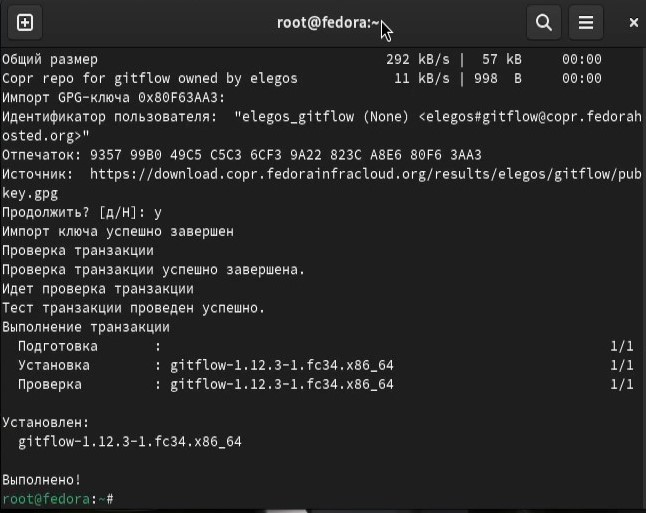
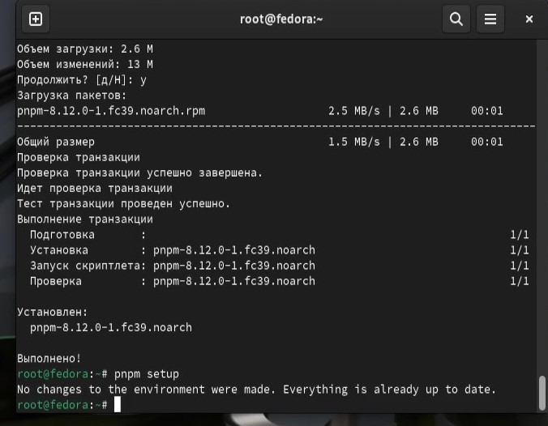
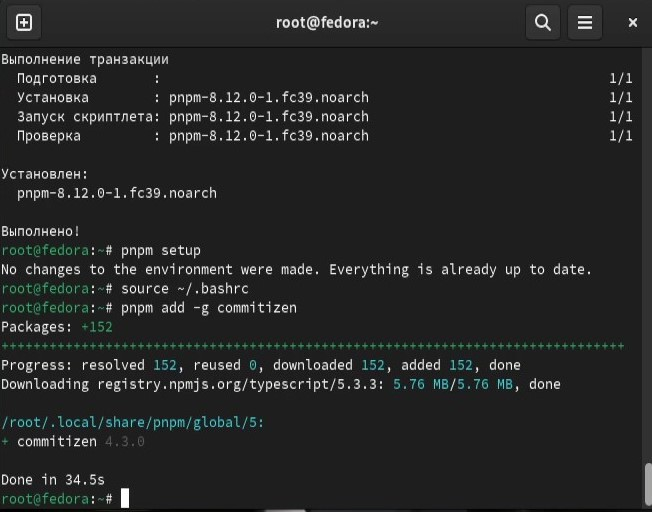
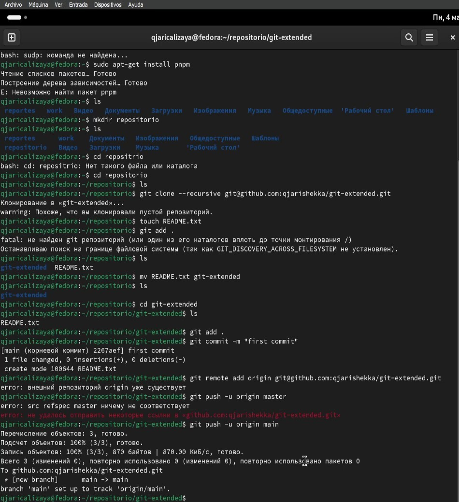

---
## Front matter
lang: ru-RU
title: Лабораторная работа Nº 4 
subtitle: gitflow
author:
  - Кализая арсе Кхари Жекка 
institute:
  - Российский университет дружбы народов, Москва, Россия
  - Объединённый институт ядерных исследований, Дубна, Россия
date: 09 марта 2024

## i18n babel
babel-lang: russian
babel-otherlangs: english

## Fonts
mainfont: PT Serif
romanfont: PT Serif
sansfont: PT Sans
monofont: PT Mono
mainfontoptions: Ligatures=TeX
romanfontoptions: Ligatures=TeX
sansfontoptions: Ligatures=TeX,Scale=MatchLowercase
monofontoptions: Scale=MatchLowercase,Scale=0.9

## Formatting pdf
toc: false
toc-title: Содержание
slide_level: 2
aspectratio: 169
section-titles: true
theme: metropolis
header-includes:
 - \metroset{progressbar=frametitle,sectionpage=progressbar,numbering=fraction}
 - '\makeatletter'
 - '\beamer@ignorenonframefalse'
 - '\makeatother'
---

# Информация

## Докладчик

:::::::::::::: {.columns align=center}
::: {.column width="70%"}

  * Кулябов Дмитрий Сергеевич
  * Кализая арсе кхари жекка, студент
  * студент кафедры прикладной информатики и теории вероятностей
  * Российский университет дружбы народов
  * [1032234412@pfur.ru](mailto:1032234412@pfur.ru)
  * <https://github.com/qjarishekka>

:::
::: {.column width="30%"}

:::
::::::::::::::

# Цель работы

Получение навыков правильной работы с репозиториями git.

# Задание

- Выполнить работу для тестового репозитория.
- Преобразовать рабочий репозиторий в репозиторий с git-flow и conventional commits.

# Выполнение лабораторной работы

## Установака `git-flow`
::::::::::::::
- установка gitflow
:::
::: {.column width="30%"}

:::
::::::::::::::

## Установка `Node.js`

::::::::::::::
- установка пакетов nodejs и pnpm
:::
::: {.column width="30%"}

:::
::::::::::::::

## Настройка `Node.js`

::::::::::::::
- иницализация pnpm
:::
::: {.column width="30%"}

:::
::::::::::::::

## Общепринятые коммиты

::::::::::::::
- работа в рабочем пространстве gitflow и реализация коммитов
:::
::: {.column width="30%"}

:::
::::::::::::::

# Выводы

Я смотрел и работал в рабочем пространстве gitflow, и приобретал навыки для работы с github.
