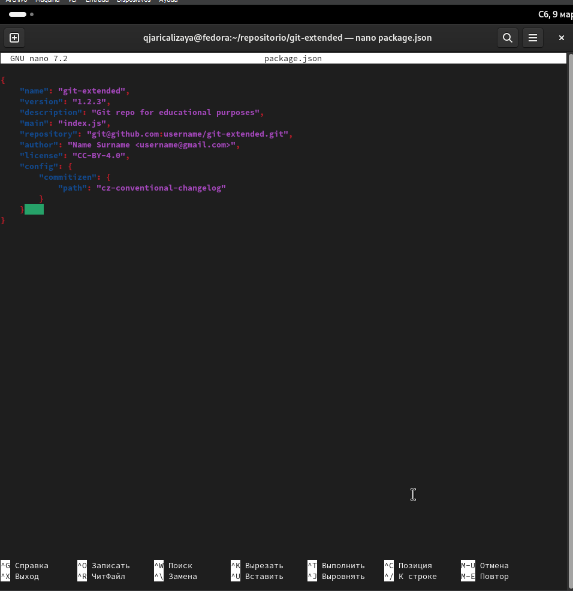
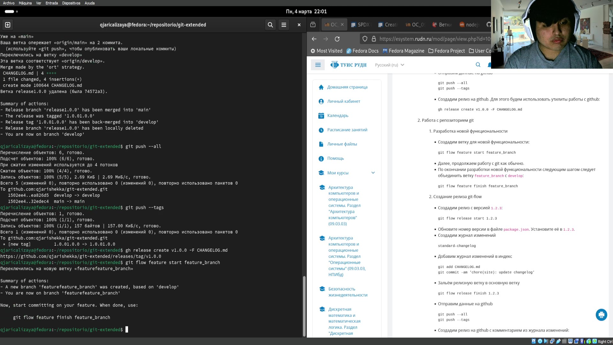
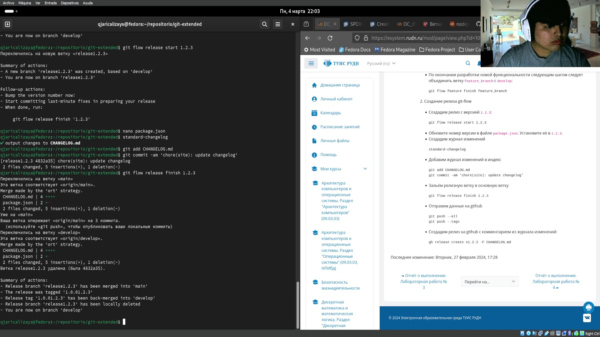

---
## Front matter
title: "Шаблон отчёта по лабораторной работa Nº 4"
subtitle: "Gitflow"
author: "Кхари Жекка Кализая Арсе"

## Generic otions
lang: ru-RU
toc-title: "Содержание"

## Bibliography
bibliography: bib/cite.bib
csl: pandoc/csl/gost-r-7-0-5-2008-numeric.csl

## Pdf output format
toc: true # Table of contents
toc-depth: 2
lof: true # List of figures
lot: true # List of tables
fontsize: 12pt
linestretch: 1.5
papersize: a4
documentclass: scrreprt
## I18n polyglossia
polyglossia-lang:
  name: russian
  options:
	- spelling=modern
	- babelshorthands=true
polyglossia-otherlangs:
  name: english
## I18n babel
babel-lang: russian
babel-otherlangs: english
## Fonts
mainfont: PT Serif
romanfont: PT Serif
sansfont: PT Sans
monofont: PT Mono
mainfontoptions: Ligatures=TeX
romanfontoptions: Ligatures=TeX
sansfontoptions: Ligatures=TeX,Scale=MatchLowercase
monofontoptions: Scale=MatchLowercase,Scale=0.9
## Biblatex
biblatex: true
biblio-style: "gost-numeric"
biblatexoptions:
  - parentracker=true
  - backend=biber
  - hyperref=auto
  - language=auto
  - autolang=other*
  - citestyle=gost-numeric
## Pandoc-crossref LaTeX customization
figureTitle: "Рис."
tableTitle: "Таблица"
listingTitle: "Листинг"
lofTitle: "Список иллюстраций"
lotTitle: "Список таблиц"
lolTitle: "Листинги"
## Misc options
indent: true
header-includes:
  - \usepackage{indentfirst}
  - \usepackage{float} # keep figures where there are in the text
  - \floatplacement{figure}{H} # keep figures where there are in the text
---

# Цель работы

Получение навыков правильной работы с репозиториями git.

# Задание

- Выполнить работу для тестового репозитория.
- Преобразовать рабочий репозиторий в репозиторий с git-flow и conventional commits.

# Теоретическое введение
## рабочий процесс Gitflow

- Рабочий процесс Gitflow Workflow. Будем описывать его с использованием пакета `git-flow`

### общая информация
- Gitflow Workflow опубликована и популяризована Винсентом Дриссеном.
- Gitflow Workflow предполагает выстраивание строгой модели ветвления с учётом выпуска проекта.
- Данная модель отлично подходит для организации рабочего процесса на основе релизов.
- Работа по модели Gitflow включает создание отдельной ветки для исправлений ошибок в рабочей среде.
- Последовательность дейсвий при работе по модели Gitflow.
 - Из ветки `master` создаётся ветка `develop`.
 - Из ветки `develop` создаётся ветка `release`.
 - Из ветки `develop` создаются ветки `feature`.
 - Когда работа над веткой `feature` завершена, она сливается с веткой `develop`.
 - Когда работа над веткой релиза `release` завершена, она сливается в ветки `develop` и `master`.
 - Если в `master` обнаружена проблема, из `master` создаётся ветка `hotfix`.
 - Когда работа над веткой исправления `hotfix` завершена, она сливается в ветки `develop` и `master`.
 
### Процесс работы с Gitflow
1. Основные ветки (master) и ветки разработки (develop)

    - для фиксации истории проекта в рамках этого процесса вместо доной ветки `master` изпользуются вде ветке. `master` хранится официальная история релиза, а ветка `develop` предназначена для объединения всех функций. Кроме того, для удобства рекомендуется присваивать всем коммитам в ветке `master` номер версии

    - При использовании библиотеки расширений git-flow нужно инициализировать структуру в существующем репозитории:

        git flow init

    - Для github параметр Version tag prefix следует установить в v.

    - После этого проверьте, на какой ветке Вы находитесь:

        git branch
        
2. Функциональные ветки (feature)

    - Под каждую новую функцию должна быть отведена собственная ветка, которую можно отправлять в центральный репозиторий для создания резервной копии или совместной работы команды. Ветки feature создаются не на основе master, а на основе develop. Когда работа над функцией завершается, соответствующая ветка сливается обратно с веткой develop. Функции не следует отправлять напрямую в ветку master.
    
    - Как правило, ветки feature создаются на основе последней ветки develop.
    
    1. Создание функциональной ветки

     - Создадим новую функциональную ветку:

            git flow feature start feature_branch

     - Далее работаем как обычно.
     
    2. Окончание работы с функциональной веткой

     - По завершении работы над функцией следует объединить ветку feature_branch с develop:

            git flow feature finish feature_branch
        
    3. Ветки выпуска (release)

     - Когда в ветке develop оказывается достаточно функций для выпуска, из ветки develop создаётся ветка release. Создание этой ветки запускает следующий цикл выпуска, и с этого момента новые функции добавить больше нельзя — допускается лишь отладка, создание документации и решение других задач. Когда подготовка релиза завершается, ветка release сливается с master и ей присваивается номер версии. После нужно выполнить слияние с веткой develop, в которой с момента создания ветки релиза могли возникнуть изменения.
     - Благодаря тому, что для подготовки выпусков используется специальная ветка, одна команда может дорабатывать текущий выпуск, в то время как другая команда продолжает работу над функциями для следующего.

     - Создать новую ветку release можно с помощью следующей команды:

            git flow release start 1.0.0

    - Для завершения работы на ветке release используются следующие команды:

            git flow release finish 1.0.0

    4. Ветки исправления (hotfix)

    - Ветки поддержки или ветки hotfix используются для быстрого внесения исправлений в рабочие релизы. Они создаются от ветки master. Это единственная ветка, которая должна быть создана непосредственно от master. Как только исправление завершено, ветку следует объединить с master и develop. Ветка master должна быть помечена обновлённым номером версии.
    Наличие специальной ветки для исправления ошибок позволяет команде решать проблемы, не прерывая остальную часть рабочего процесса и не ожидая следующего цикла релиза.

    - ветку hotfix можно создать с помощью следующих команд:

            git flow hotfix start hotfix_branch

    - По завершении работы ветка hotfix объединяется с master и develop:

            git flow hotfix finish hotfix_branch

## Семантическое версионирование

Семантический подход в версионированию программного обеспечения

### Краткое описание семантического версионирования

- Семантическое версионирование описывается в манифесте семантического версионирования.

- Кратко его можно описать следующим образом:
    - Версия задаётся в виде кортежа МАЖОРНАЯ_ВЕРСИЯ.МИНОРНАЯ_ВЕРСИЯ.ПАТЧ.
    - Номер версии следует увеличивать:
      - МАЖОРНУЮ версию, когда сделаны обратно несовместимые изменения API.
      - МИНОРНУЮ версию, когда вы добавляете новую функциональность, не нарушая обратной совместимости.
      - ПАТЧ-версию, когда вы делаете обратно совместимые исправления.
    - Дополнительные обозначения для предрелизных и билд-метаданных возможны как дополнения к МАЖОРНАЯ.МИНОРНАЯ.ПАТЧ формату.

### Программное обеспечение
- Для реализации семантического версионирования создано несколько программных продуктов.
- При этом лучше всего использовать комплексные продукты, которые используют информацию из коммитов системы версионирования.
- Коммиты должны иметь стандартизованный вид.
- В семантическое версионирование применяется вместе с общепринятыми коммитами.

1. Пакет Conventional Changelog
    - Пакет Conventional Changelog является комплексным решением по управлению коммитами и генерации журнала изменений.
    - Содержит набор утилит, которые можно использовать по-отдельности.

## Общепринятые коммиты

Использование спецификации Conventional Commits.

### Описание

Спецификация Conventional Commits:

- Соглашение о том, как нужно писать сообщения commit'ов.
- Совместимо с SemVer. Даже вернее сказать, сильно связано с семантическим версионированием.
- Регламентирует структуру и основные типы коммитов.

  1. Структура коммита:

            <type>(<scope>): <subject>
            <BLANK LINE>
            <body>
            <BLANK LINE>
            <footer>
    
  Или, по-русски:

            <тип>(<область>): <описание изменения>
            <пустая линия>
            [необязательное тело]
            <пустая линия>
            [необязательный нижний колонтитул]

  - Заголовок является обязательным.
  - Любая строка сообщения о фиксации не может быть длиннее 100 символов.
  - Тема (subject) содержит краткое описание изменения.
    - Используйте повелительное наклонение в настоящем времени: «изменить» ("change" not "changed" nor "changes").
    - Не используйте заглавную первую букву.
    - Не ставьте точку в конце.

  - Тело (body) должно включать мотивацию к изменению и противопоставлять это предыдущему поведению.
    - Как и в теме, используйте повелительное наклонение в настоящем времени.

  - Нижний колонтитул (footer) должен содержать любую информацию о критических изменениях.
    - Следует использовать для указания внешних ссылок, контекста коммита или другой мета информации.
    - Также содержит ссылку на issue (например, на github), который закрывает эта фиксация.
    - Критические изменения должны начинаться со слова BREAKING CHANGE: с пробела или двух символов новой строки. Затем для этого используется остальная часть сообщения фиксации.

  2. Типы коммитов

     1. Базовые типы коммитов
        - `fix`: — коммит типа fix исправляет ошибку (bug) в вашем коде (он соответствует PATCH в SemVer).
        - `feat`: — коммит типа feat добавляет новую функцию (feature) в ваш код (он соответствует MINOR в SemVer).
        - `BREAKING CHANGE`: — коммит, который содержит текст `BREAKING CHANGE`: в начале своего не обязательного тела сообщения (body) или в подвале (footer), добавляет изменения, нарушающие обратную совместимость вашего API (он соответствует MAJOR в SemVer). `BREAKING CHANGE` может быть частью коммита любого типа.
        - `revert`: — если фиксация отменяет предыдущую фиксацию. Начинается с `revert`:, за которым следует заголовок отменённой фиксации. В теле должно быть написано: Это отменяет фиксацию `<hash>` (это SHA-хэш отменяемой фиксации).
        - `Другое`: коммиты с типами, которые отличаются от `fix`: и `feat`:, также разрешены. Например, `@commitlint/config-conventional` (основанный на The Angular convention) рекомендует: chore:, docs:, style:, refactor:, perf:, test:, и другие.
    
     2. Соглашения The Angular convention

        - Одно из популярных соглашений о поддержке исходных кодов — конвенция Angular (The Angular convention).
          1. Типы коммитов The Angular convention

                - Конвенция Angular (The Angular convention) требует следующие типы коммитов:

                - build: — изменения, влияющие на систему сборки или внешние зависимости (примеры областей (scope): gulp, broccoli, npm).
                - ci: — изменения в файлах конфигурации и скриптах CI (примеры областей: Travis, Circle, BrowserStack, SauceLabs).
                - docs: — изменения только в документации.
                - feat: — новая функция.
                - fix: — исправление ошибок.
                - perf: — изменение кода, улучшающее производительность.
                - refactor: — Изменение кода, которое не исправляет ошибку и не добавляет функции (рефакторинг кода).
                - style: — изменения, не влияющие на смысл кода (пробелы, форматирование, отсутствие точек с запятой и т. д.).
                - test: — добавление недостающих тестов или исправление существующих тестов.

          2. Области действия (scope)

            Областью действия должно быть имя затронутого пакета npm (как его воспринимает человек, читающий журнал изменений, созданный из сообщений фиксации).

            Есть несколько исключений из правила «использовать имя пакета»:

            - packaging — используется для изменений, которые изменяют структуру пакета, например, изменения общедоступного пути.
            - changelog — используется для обновления примечаний к выпуску в CHANGELOG.md.
            - отсутствует область действия — полезно для изменений стиля, тестирования и рефакторинга, которые выполняются во всех пакетах (например, style: добавить отсутствующие точки с запятой).
    
          3. Соглашения `@commitlint/config-conventional`

        Соглашение `@commitlint/config-conventional` входит в пакет `Conventional Changelog`. В целом в этом соглашении придерживаются соглашения Angular.

Более подробно про Unix см. в [@tanenbaum_book_modern-os_ru; @robbins_book_bash_en; @zarrelli_book_mastering-bash_en; @newham_book_learning-bash_en].

# Выполнение лабораторной работы

Я начинал эту лабораторную работу, активировая elegos/gitflow и устанавливая gitflow (рис. [-@fig:001]) и (рис. [-@fig:002]).

            dnf copr enable elegos/gitflow
            dnf install gitflow

{#fig:001 width=70%}

{#fig:002 width=70%}

Потом я написал команды для уставления программы "node.js" (рис. [-@fig:003]) и (рис. [-@fig:004]).
            
            dnf install nodejs
            dnf install pnpm

{#fig:003 width=70%}

{#fig:004 width=70%}

Дальше я инициализировал исполняемый файл "pnpm" (рис. [-@fig:005]).

            pnpm setup

{#fig:005 width=70%}

в моем случае ничиго изменился, поэтому я не перелогинился. Потом я выполнил следующую команду (рис. [-@fig:006]).
                
            source ~/.bashrc
            
{#fig:006 width=70%}

Затем я написал команду (рис. [-@fig:007]).

            pnpm add -g commitizen
            
{#fig:007 width=70%}

            
Эта программа помогает в форматировании коммитов. Эта команда скачала "git-cz".

Следующая команда, которую я ввел был (рис. [-@fig:008]).

            pnpm add -g standard-changelog
            
{#fig:008 width=70%}

            
эта команда скачала скрипт "standard-changelog"

Дальше я создал новый репозиторий для работы с "gitflow" я назвал его "git extended" и я создал его в интернете-сайте github.com (рис. [-@fig:009]).

{#fig:009 width=70%}

Затем я клонировал его (рис. [-@fig:010])

{#fig:010 width=70%}

Потом я создал файл "readme.txt" чтобы заполнять репозиторий. Затем я написал комнаду 

            git add .

и потом написал команду для первого коммита (рис. [-@fig:011]).
            
            git commit -m "first commit"

{#fig:011 width=70%}

и загрузил файл с комнадой (рис. [-@fig:012]).

            git push -u origin main

{#fig:012 width=70%}

Затем я начал конфигурацию  общепринятых коммитов. в первых я настройл пакеты Node.js (рис. [-@fig:013]).

            pnpm init
            
{#fig:013 width=70%}
            
            
            
Она создала файл "package.json", который я перезаписывал, копировая текст находящий в сайте https://spdx.org/licenses/. я открил его с помощью "nano" (рис. [-@fig:014]).

{#fig:014 width=70%}

Потом добавил его (рис. [-@fig:015]).
        
            git add .
            git cz
            git push

 {#fig:015 width=70%}
 
 
 

Я отвечал вопросы, задававшие терминалом.

Потом я настройл "gitflow" (рис. [-@fig:016])

            git flow init

{#fig:016 width=70%}
 
 
 
            
Мне надо было настроить его. Я назвал все ветки по умолчанию.

Потом я проверил что я находился в ветке "develop" (рис. [-@fig:017]).
            
            git branch

{#fig:017 width=70%}

Затем я загрузил всё (рис. [-@fig:018]).

            git push --all

{#fig:018 width=70%}

Дальше я установил новую ветку как вышестоящую для этой ветки. (рис. [-@fig:019]).

            git branch --set-upstream-to=origin/develop develop

{#fig:019 width=70%}

Потом я создал релиз как версия 1.0.0 (рис. [-@fig:020]).

            git flow release start 1.0.0
            
{#fig:020 width=70%}

И добавил журнал изменений (рис. [-@fig:021]).

            standard-changelog --first-release
            
{#fig:021 width=70%}

И добавил журнал изменений в индекс (рис. [-@fig:022]).

            git add CHANGELOG.md
            git commit -am 'chore(site): add changelog'
            
{#fig:022 width=70%}

Потом я залил релизную ветку в основную ветку (рис. [-@fig:023]).

            git flow release finish 1.0.0

{#fig:023 width=70%}

И Загрузил изменения на сервер (рис. [-@fig:024]).
            
            git push --all
            git push --tags

{#fig:024 width=70%}

Затем я использовал утилиты работы с github для создания релиза на github. (рис. [-@fig:025]).

            gh release create v1.0.0 -F CHANGELOG.md

{#fig:025 width=70%}

Потом я создал ветку для новой функциональности (рис. [-@fig:026]).

            git flow feature start feature_branch

{#fig:026 width=70%}

После создания этой ветки мы можем работать как обычно и когда мы заканчиваем мы можем объединить векту feature_branch c develop  (рис. [-@fig:027]).

            git flow feature finish feature_branch

{#fig:027 width=70%}

Затем я создал релиз с версией 1.2.3 (рис. [-@fig:028]).

            git flow release start 1.2.3

{#fig:028 width=70%}

это изменение версии должны быть написаны в файле package.json (рис. [-@fig:029]).

            nano package.json

{#fig:029 width=70%}

Потом я добавил в журнале изменения в индекс (рис. [-@fig:030]).

            git add CHANGELOG.md
            git commit -am 'chore(site): update changelog'

{#fig:030 width=70%}

Залил релизную ветку в основную ветку (рис. [-@fig:031]).

            git flow release finish 1.2.3

{#fig:031 width=70%}

И я отправил данные на github (рис. [-@fig:032]).

            git push --all
            git push --tags

{#fig:032 width=70%}

И на конец я создал релиз на github с комментарием из журнала изменений  (рис. [-@fig:033]).

            gh release create v1.2.3 -F CHANGELOG.md

{#fig:033 width=70%}

# Выводы 

Я смотрел и работал в рабочем пространстве gitflow, и приобретал навыки для работы с github.

# Список литературы{.unnumbered}

::: {#refs}
:::
