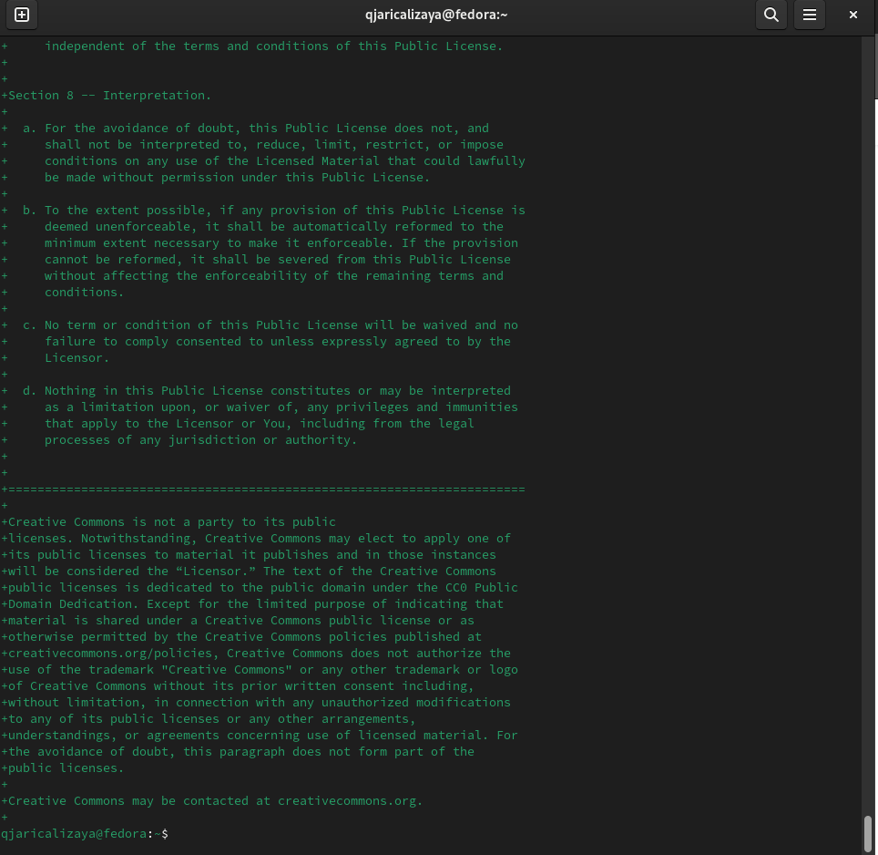

---
## Front matter
title: "Шаблон отчёта по лабораторной работе"
subtitle: "Простейший вариант"
author: "Дмитрий Сергеевич Кулябов"

## Generic otions
lang: ru-RU
toc-title: "Содержание"

## Bibliography
bibliography: bib/cite.bib
csl: pandoc/csl/gost-r-7-0-5-2008-numeric.csl

## Pdf output format
toc: true # Table of contents
toc-depth: 2
lof: true # List of figures
lot: true # List of tables
fontsize: 12pt
linestretch: 1.5
papersize: a4
documentclass: scrreprt
## I18n polyglossia
polyglossia-lang:
  name: russian
  options:
	- spelling=modern
	- babelshorthands=true
polyglossia-otherlangs:
  name: english
## I18n babel
babel-lang: russian
babel-otherlangs: english
## Fonts
mainfont: PT Serif
romanfont: PT Serif
sansfont: PT Sans
monofont: PT Mono
mainfontoptions: Ligatures=TeX
romanfontoptions: Ligatures=TeX
sansfontoptions: Ligatures=TeX,Scale=MatchLowercase
monofontoptions: Scale=MatchLowercase,Scale=0.9
## Biblatex
biblatex: true
biblio-style: "gost-numeric"
biblatexoptions:
  - parentracker=true
  - backend=biber
  - hyperref=auto
  - language=auto
  - autolang=other*
  - citestyle=gost-numeric
## Pandoc-crossref LaTeX customization
figureTitle: "Рис."
tableTitle: "Таблица"
listingTitle: "Листинг"
lofTitle: "Список иллюстраций"
lotTitle: "Список таблиц"
lolTitle: "Листинги"
## Misc options
indent: true
header-includes:
  - \usepackage{indentfirst}
  - \usepackage{float} # keep figures where there are in the text
  - \floatplacement{figure}{H} # keep figures where there are in the text
---

# Цель работы

Создать и соединять репозиторий с утилитами, используя chezmoi.

# Задание

установить утилиты, настроить интерфейс и подключить репозиторий к своей системе.

# Теоретическое введение

## Менеджер паролей pass

- Менеджер паролей pass — программа, сделанная в рамках идеологии Unix.
- Также носит название стандартного менеджера паролей для Unix (The standard Unix password manager).

### Основные свойства

- Данные хранятся в файловой системе в виде каталогов и файлов.
- Файлы шифруются с помощью GPG-ключа.

### Структура базы паролей

- Структура базы может быть произвольной, если Вы собираетесь использовать её напрямую, без промежуточного программного обеспечения. Тогда семантику структуры базы данных Вы держите в своей голове.
- Если же необходимо использовать дополнительное программное обеспечение, необходимо семантику заложить в структуру базы паролей.
    
#### Семантическая структура базы паролей

- Рассмотрим пользователя user в домене example.com, порт 22.

- Отсутствие имени пользователя или порта в имени файла означает, что любое имя пользователя и порт будут совпадать:

            example.com.pgp

- Соответствующее имя пользователя может быть именем файла внутри каталога, имя которого совпадает с хостом. Это полезно, если в базе есть пароли для нескольких пользователей на одном хосте:

            example.com/user.pgp

- Имя пользователя также может быть записано в виде префикса, отделенного от хоста знаком @:

            user@example.com.pgp

- Соответствующий порт может быть указан после хоста, отделённый двоеточием (:):

            example.com:22.pgp
            example.com:22/user.pgp
            user@example.com:22.pgp

- Эти все записи могут быть расположены в произвольных каталогах, задающих Вашу собственную иерархию.

### Реализации
#### Утилиты командной строки

- На данный момент существует 2 основных реализации:
    - pass — классическая реализация в виде shell-скриптов (https://www.passwordstore.org/);
    - gopass — реализация на go с дополнительными интегрированными функциями (https://www.gopass.pw/).
- Дальше в тексте будет использоваться программа pass, но всё то же самое можно сделать с помощью программы gopass.

#### Графические интерфейсы

1. qtpass
   -  qtpass — может работать как графический интерфейс к pass, так и как самостоятельная программа. В настройках можно переключаться между использованием pass и gnupg.

2. gopass-ui
   - gopass-ui — интерфейс к gopass.

3. webpass
   - Репозиторий: https://github.com/emersion/webpass
   - Веб-интерфейс к pass.
   - Написано на golang.

#### приложения для Android

1. Password Store
   - URL: https://play.google.com/store/apps/details?id=dev.msfjarvis.aps
   - Репозиторий с кодом: https://github.com/android-password-store/Android-Password-Store
   - Документация: https://android-password-store.github.io/docs/
   - Для синхронизации с git необходимо импортировать ssh-ключи.
   - Поддерживает разблокировку по биометрическим данным.
   - Для работы требует наличия OpenKeychain: Easy PGP.
   
2. OpenKeychain: Easy PGP
   - URL: https://play.google.com/store/apps/details?id=org.sufficientlysecure.keychain
   - Операции с ключами pgp.
   - Необходимо будет импортировать pgp-ключи.
   - Не поддерживает разблокировку по биометрическим данным. Необходимо набирать пароль ключа.
 
 

#### Пакеты для Emacs

1. pass
   - Основной режим для управления хранилищем и редактирования записей.
   - Emacs. Пакет pass
   - Репозиторий: https://github.com/NicolasPetton/pass
   - Позволяет редактировать базу данных паролей.
   - Запуск

            M-x pass
            
2. helm-pass
   - Интерфейс helm для pass.
   - Репозиторий: https://github.com/emacs-helm/helm-pass
   - Запуск
   
            M-x helm-pass
   - Выдаёт в минибуфере список записей из базы паролей. При нажатии Enter копирует пароль в буфер.
   
3. ivy-pass
   - Интерфейс ivy для pass.
   - Репозиторий: https://github.com/ecraven/ivy-pass
 

## Управление файлами конфигурации
- Использование chezmoi для управления файлами конфигурации домашнего каталога пользователя.

### Обшая информация
- Сайт: https://www.chezmoi.io/
- Репозиторий: https://github.com/twpayne/chezmoi

### Конфигурация *chezmoi* 

#### Рабочие файлы
- Состояние файлов конфигурации сохраняется в каталоге
            ~/.local/share/chezmoi

- Он является клоном вашего репозитория dotfiles.
- Файл конфигурации ~/.config/chezmoi/chezmoi.toml (можно использовать также JSON или YAML) специфичен для локальной машины.
- Файлы, содержимое которых одинаково на всех ваших машинах, дословно копируются из исходного каталога.
- Файлы, которые варьируются от машины к машине, выполняются как шаблоны, обычно с использованием данных из файла конфигурации локальной машины для настройки конечного содержимого, специфичного для локальной машины.
- При запуске
            chezmoi apply

вычисляется желаемое содержимое и разрешения для каждого файла, а затем вносит необходимые изменения, чтобы ваши файлы соответствовали этому состоянию.
- По умолчанию chezmoi изменяет файлы только в рабочей копии.

#### Автоматически создавать файл конфигурации на новой машине
- При выполнении chezmoi init также может автоматически создать файл конфигурации, если он еще не существует.
- Если ваш репозиторий содержит файл с именем .chezmoi.$FORMAT.tmpl, где $FORMAT есть один из поддерживаемых форматов файла конфигурации (json, toml, или yaml), то chezmoi init выполнит этот шаблон для создания исходного файла конфигурации.
- Например, пусть ~/.local/share/chezmoi/.chezmoi.toml.tmpl выглядит так:

            {{- $email := promptStringOnce . "email" "Email address" -}}

            [data]
             email = {{ $email | quote }}

   - При выполнении chezmoi init будет создан конфигурационный файл ~/.config/chezmoi/chezmoi.toml.
   - promptStringOnce — это специальная функция, которая запрашивает у пользователя значение, если оно еще не установлено в разделе data конфигурационного файла.
- Чтобы протестировать этот шаблон, используйте chezmoi execute-template с флагами --init и --promptString, например:

            chezmoi execute-template --init --promptString email=me@home.org < ~/.local/share/chezmoi/.chezmoi.toml.tmpl
            

#### Пересоздание файл конфигурации
- Если вы измените шаблон файла конфигурации, chezmoi предупредит вас, если ваш текущий файл конфигурации не был сгенерирован из этого шаблона.
- Вы можете повторно сгенерировать файл конфигурации, запустив:

            chezmoi init

### Шаблоны

#### Общая информация
- Шаблоны используются для изменения содержимого файла в зависимости от среды.
- Используется синтаксис шаблонов Go.
- Файл интерпретируется как шаблон, если выполняется одно из следующих условий: 
   - имя файла имеет суффикс .tmpl;
   - файл находится в каталоге .chezmoitemplates.

#### Данные шаблона
- Полный список переменных шаблона:

            chezmoi data

- Источники переменных: 
   - файлы .chezmoi, например, .chezmoi.os;
   - файлы конфигурации .chezmoidata.$FORMAT. Форматы (json, jsonc, toml, yaml) читаются в алфавитном порядке;
   - раздел data конфигурационного файла.

#### Способы создания файла шаблона
- При первом добавлении файла передайте аргумент --template:

            chezmoi add --template ~/.zshrc
- Если файл уже контролируется chezmoi, но не является шаблоном, можно сделать его шаблоном:

            chezmoi chattr +template ~/.zshrc
            
- Можно создать шаблон вручную в исходном каталоге, присвоив ему расширение .tmpl:

            chezmoi cd
            $EDITOR dot_zshrc.tmpl
            
- Шаблоны в каталоге .chezmoitemplates должны создаваться вручную:

            chezmoi cd
            mkdir -p .chezmoitemplates
            cd .chezmoitemplates
            $EDITOR mytemplate

#### Редактирование файла шаблона
- Используйте chezmoi edit:

            chezmoi edit ~/.zshrc
            
- Чтобы сделанные вами изменения сразу же применялись после выхода из редактора, используйте опцию --apply:

            chezmoi edit --apply ~/.zshrc
   
#### Тестирование шаблонов
- Тестирование с помощью команды chezmoi execute-template.
- Тестирование небольших фрагментов шаблонов:
            
            chezmoi execute-template '{{ .chezmoi.hostname }}'
            
- Тестирование целых файлов:

            chezmoi cd
            chezmoi execute-template < dot_zshrc.tmpl
            
#### Синтаксис шаблона

- Действия шаблона записываются внутри двойных фигурных скобок, {{ }}.
- Действия могут быть переменными, конвейерами или операторами управления.
- Текст вне действий копируется буквально.
- Переменные записываются буквально:
            
            {{ .chezmoi.hostname }}
            
- Условные выражения могут быть записаны с использованием if, else if, else, end:
            
            {{ if eq .chezmoi.os "darwin" }}

darwin

            {{ else if eq .chezmoi.os "linux" }}
            
linux

            {{ else }}
            
other operating system

            {{ end }}

1. Удаление пробелов
- Для удаления проблем в шаблоне разместите знак минус и пробела рядом со скобками:
            
            HOSTNAME={{- .chezmoi.hostname }}
            
- В результате получим:
            
            HOSTNAME=myhostname

2. Отладка шаблона
- Используется подкоманда execute-template:
            
            chezmoi execute-template '{{ .chezmoi.os }}/{{ .chezmoi.arch }}'

- Интерпретируются любые данные, поступающие со стандартного ввода или в конце команды.
- Можно передать содержимое файла этой команде:
            
            cat foo.txt | chezmoi execute-template

3. Логические операции

- Возможно выполнение логических операций.
- Если имя хоста машины равно work-laptop, текст между if и end будет включён в результат:
            
            # common config
            export EDITOR=vi
            
            # machine-specific configuration
            {{- if eq .chezmoi.hostname "work-laptop" }}
            # this will only be included in ~/.bashrc on work-laptop
            {{- end }}

   1. Логические функции
      - eq: возвращает true, если первый аргумент равен любому из остальных аргументов, может принимать несколько аргументов;
      - not: возвращает логическое отрицание своего единственного аргумента;
      - and: возвращает логическое И своих аргументов, может принимать несколько аргументов;
      - or: возвращает логическое ИЛИ своих аргументов, может принимать несколько аргументов.

   2. Целочисленные функции
      - len: возвращает целочисленную длину своего аргумента;
      - eq: возвращает логическую истину arg1 == arg2;
      - ne: возвращает логическое значение arg1 != arg2;
      - lt: возвращает логическую истину arg1 < arg2;
      - le: возвращает логическую истину arg1 <= arg2;
      - gt: возвращает логическую истину arg1 > arg2;
      - ge: возвращает логическую истину arg1 >= arg2.

### Переменные шаблона
- Чтобы просмотреть переменные, доступные в вашей системе, выполните:
            
            chezmoi data

- Чтобы получить доступ к переменной chezmoi.kernel.osrelease в шаблоне, используйте:
            
            {{ .chezmoi.kernel.osrelease }}

Более подробно про Unix см. в [@tanenbaum_book_modern-os_ru; @robbins_book_bash_en; @zarrelli_book_mastering-bash_en; @newham_book_learning-bash_en].

# Выполнение лабораторной работы

## установка 

я начал эту лабораторную работу, устанавливая pass и gopass (рис. [-@fig:001]) (рис. [-@fig:002]).
        
            dnf install pass pass-otp
            dnf install gopass

{#fig:001 width=70%}

{#fig:002 width=70%}

## настройка

Потом я настроил ключ gpg (рис. [-@fig:003]).

            gpg --list-secret-keys
            
{#fig:003 width=70%}

У меня уже ключ, поэтому я не создал новой ключ.

Затем я инициализироовал хранилища (рис. [-@fig:004]).

            pass init <gpg-id or email>

            pass git init

{#fig:004 width=70%}

Дальше я задал адрес репозитория на хостинге. (рис. [-@fig:005]).

            pass git remote add origin git@github.com:<git_username>/<git_repo>.git

Потом я начинал синхронизацию. (рис. [-@fig:005]).

            pass git pull
            pass git push

{#fig:005 width=70%}

Потом я сделал изменение непосредственно на файловой системе и закоммитить вручную изменения. (рис. [-@fig:006]).

            cd ~/.password-store/
            git add .
            git commit -am 'edit manually'
            git push

{#fig:006 width=70%}

Затем я проверил статус синхронизации (рис. [-@fig:007]).

            pass git status

{#fig:007 width=70%}

## Настройка интерфейса с броузером

Во-первых я установил add-on в броузере (рис. [-@fig:008]).

{#fig:008 width=70%}

Во-вторых я установил browser pass. (рис. [-@fig:009]) и (рис. [-@fig:010]) .

            dnf copr enable maximbaz/browserpass
            dnf install browserpass

{#fig:009 width=70%}

{#fig:010 width=70%}

## Сохранение пароля

я добавил новый пароль (рис. [-@fig:011]) и сохранил его в каталоге password.

            pass insert password/password

{#fig:011 width=70%}

Потом я отобразил пароль (рис. [-@fig:012]).

            pass password/password

{#fig:012 width=70%}

И заменил существующий пароль (рис. [-@fig:013]).

            pass generate --in-place password/password
            
{#fig:013 width=70%}

## Управление файлами конфигурации
### Дополнительное программное обеспечение

Я установил несколько программных обеспечений (рис. [-@fig:014]).

            sudo dnf -y install \
                 dunst \
                 fontawesome-fonts \
                 powerline-fonts \
                 light \
                 fuzzel \
                 swaylock \
                 kitty \
                 waybar swaybg \
                 wl-clipboard \
                 mpv \
                 grim \
                 slurp

{#fig:014 width=70%}

Потом я установил шрифты (рис. [-@fig:015]).

            sudo dnf copr enable peterwu/iosevka
            sudo dnf search iosevka
            sudo dnf install iosevka-fonts iosevka-aile-fonts iosevka-curly-fonts iosevka-slab-fonts iosevka-etoile-fonts iosevka-term-fonts

{#fig:015 width=70%}

### Установка 

Я установил бинарный файл chezmoi (рис. [-@fig:016]).

        sh -c "$(wget -qO- chezmoi.io/get)"

{#fig:016 width=70%}

### Создание собственного репозитория с помощью утилит

Потом я копировал репозиторий dotfiles (рис. [-@fig:017]).

            gh repo create dotfiles --template="yamadharma/dotfiles-template" --private

{#fig:017 width=70%}

### Подключение репозитория к своей системе

Затем я инициализировал chezmoi (рис. [-@fig:018]).

            chezmoi init git@github.com:qjarishekka/dotfiles.git

{#fig:018 width=70%}

И проверал изменения (рис. [-@fig:019]).

            chezmoi diff

{#fig:019 width=70%}

### Использование chezmoi на нескольких машинах

Для выполнения этой части я включил новую виртуальную машину. установил chezmoi и несколько пакетов для правильно работы и инициализировал chezmoi там. (рис. [-@fig:020]).

            chezmoi init git@github.com:qjarishekka/dotfiles.git

{#fig:020 width=70%}

Затем я проверил изменения (рис. [-@fig:021]).

            chezmoi diff
            
{#fig:021 width=70%}

И запускал команду (рис. [-@fig:022]).

            chezmoi apply -v

{#fig:022 width=70%}

Потом я получил и применил последние изменения из моего репозитория (рис. [-@fig:023]).

            chezmoi update -v

{#fig:023 width=70%}

### Ежедневные операции c chezmoi

Здесь я извлек изменения из репозитория и применил их (рис. [-@fig:024]).

            chezmoi update

{#fig:024 width=70%}

Потом я извлек последние изменения из своего репозитория. ничего изменился. .

            chezmoi git pull -- --autostash --rebase && chezmoi diff

Затем я применил изменения (рис. [-@fig:025])

            chezmoi apply

{#fig:025 width=70%}

Дальше я проверял конфигурацию в файле ~/.config/chezmoi/chezmoi.toml (рис. [-@fig:026]).

            sudo nano ~/.config/chezmoi/chezmoi.toml

{#fig:026 width=70%}

# Выводы

В этой лабораторной работе, я смотрел процесс настройки и синхронизации репозитория с помощью chezmoi.

# Список литературы{.unnumbered}

::: {#refs}
:::
