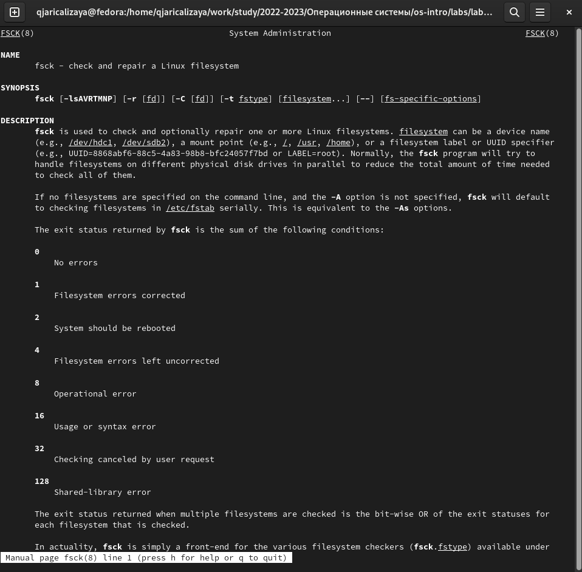

---
## Front matter
title: "Шаблон отчёта по лабораторной работе №7"
subtitle: "Анализ файловой системы Linux"
author: "Кхари Жекка Кализая Арсе"

## Generic otions
lang: ru-RU
toc-title: "Содержание"

## Bibliography
bibliography: bib/cite.bib
csl: pandoc/csl/gost-r-7-0-5-2008-numeric.csl

## Pdf output format
toc: true # Table of contents
toc-depth: 2
lof: true # List of figures
lot: true # List of tables
fontsize: 12pt
linestretch: 1.5
papersize: a4
documentclass: scrreprt
## I18n polyglossia
polyglossia-lang:
  name: russian
  options:
	- spelling=modern
	- babelshorthands=true
polyglossia-otherlangs:
  name: english
## I18n babel
babel-lang: russian
babel-otherlangs: english
## Fonts
mainfont: PT Serif
romanfont: PT Serif
sansfont: PT Sans
monofont: PT Mono
mainfontoptions: Ligatures=TeX
romanfontoptions: Ligatures=TeX
sansfontoptions: Ligatures=TeX,Scale=MatchLowercase
monofontoptions: Scale=MatchLowercase,Scale=0.9
## Biblatex
biblatex: true
biblio-style: "gost-numeric"
biblatexoptions:
  - parentracker=true
  - backend=biber
  - hyperref=auto
  - language=auto
  - autolang=other*
  - citestyle=gost-numeric
## Pandoc-crossref LaTeX customization
figureTitle: "Рис."
tableTitle: "Таблица"
listingTitle: "Листинг"
lofTitle: "Список иллюстраций"
lotTitle: "Список таблиц"
lolTitle: "Листинги"
## Misc options
indent: true
header-includes:
  - \usepackage{indentfirst}
  - \usepackage{float} # keep figures where there are in the text
  - \floatplacement{figure}{H} # keep figures where there are in the text
---

# Цель работы

Ознакомление с файловой системой Linux, её структурой, именами и содержанием
каталогов. Приобретение практических навыков по применению команд для работы
с файлами и каталогами, по управлению процессами (и работами), по проверке исполь-
зования диска и обслуживанию файловой системы.

# Задание

Выполнить команды примеров и задачи.

1. Выполните все примеры, приведённые в первой части описания лабораторной работы.

2. Выполните следующие действия, зафиксировав в отчёте по лабораторной работе
используемые при этом команды и результаты их выполнения:

   2.1 Скопируйте файл /usr/include/sys/io.h в домашний каталог и назовите его
equipment. Если файла io.h нет, то используйте любой другой файл в каталоге
/usr/include/sys/ вместо него.

   2.2 В домашнем каталоге создайте директорию ~/ski.plases.

   2.3 Переместите файл equipment в каталог ~/ski.plases.

   2.4 Переименуйте файл ~/ski.plases/equipment в ~/ski.plases/equiplist.

   2.5 Создайте в домашнем каталоге файл abc1 и скопируйте его в каталог ~/ski.plases, назовите его equiplist2.

   2.6 Создайте каталог с именем equipment в каталоге ~/ski.plases.

   2.7 Переместите файлы ~/ski.plases/equiplist и equiplist2 в каталог ~/ski.plases/equipment.

   2.8. Создайте и переместите каталог ~/newdir в каталог ~/ski.plases и назовите его plans. Кулябов Д. С. и др. Операционные системы 53

3. Определите опции команды chmod, необходимые для того, чтобы присвоить перечис-
ленным ниже файлам выделенные права доступа, считая, что в начале таких прав
нет:

   3.1. drwxr--r-- ... australia
   
   3.2. drwx--x--x ... play
   
   3.3. -r-xr--r-- ... my_os
   
   3.4. -rw-rw-r-- ... feathers
   
При необходимости создайте нужные файлы.

4. Проделайте приведённые ниже упражнения, записывая в отчёт по лабораторной
работе используемые при этом команды:

   4.1. Просмотрите содержимое файла /etc/password.
   
   4.2. Скопируйте файл ~/feathers в файл ~/file.old.
   
   4.3. Переместите файл ~/file.old в каталог ~/play.
   
   4.4. Скопируйте каталог ~/play в каталог ~/fun.
   
   4.5. Переместите каталог ~/fun в каталог ~/play и назовите его games.
   
   4.6. Лишите владельца файла ~/feathers права на чтение.
   
   4.7. Что произойдёт, если вы попытаетесь просмотреть файл ~/feathers командой cat?
   
   4.8. Что произойдёт, если вы попытаетесь скопировать файл ~/feathers?
   
   4.9. Дайте владельцу файла ~/feathers право на чтение.
   
   4.10. Лишите владельца каталога ~/play права на выполнение.
   
   4.11. Перейдите в каталог ~/play. Что произошло?
   
   4.12. Дайте владельцу каталога ~/play право на выполнение.
   
5. Прочитайте man по командам mount, fsck, mkfs, kill и кратко их охарактеризуйте,
приведя пример

# Теоретическое введение

## Команды для работы с файлами и каталогами

Для создания текстового файла можно использовать команду touch.

Формат команды:

            touch имя-файла

Для просмотра файлов небольшого размера можно использовать команду cat.

Формат команды:

            cat имя-файла

Для просмотра файлов постранично удобнее использовать команду less.

Формат команды:

            less имя-файла

Следующие клавиши используются для управления процессом просмотра:

- **Space** — переход к следующей странице
- **ENTER** — сдвиг вперёд на одну строку,
- **b** — возврат на предыдущую страницу,
- **h** — обращение за подсказкой,
- **q** — выход из режима просмотра файла.

Команда head выводит по умолчанию первые 10 строк файла.

Формат команды:

            head [-n] имя-файла

где n — количество выводимых строк.

Команда tail выводит умолчанию 10 последних строк файла.

Формат команды:

            tail [-n] имя-файла

где n — количество выводимых строк

## Копирование файлов и каталогов

Команда cp используется для копирования файлов и каталогов.

Формат команды:

            cp [-опции] исходный_файл целевой_файл

**Примеры:**

1. Копирование файла в текущем каталоге. Скопировать файл ~/abc1 в файл april и в файл may:

            cd
            touch abc1
            cp abc1 april
            cp abc1 may

2. Копирование нескольких файлов в каталог. Скопировать файлы april и may в каталог monthly:

            mkdir monthly
            cp april may monthly

3. Копирование файлов в произвольном каталоге. Скопировать файл monthly/may в файл с именем june:

            cp monthly/may monthly/june
            ls monthly

Опция i в команде cp выведет на экран запрос подтверждения о перезаписи файла.
Для рекурсивного копирования каталогов, содержащих файлы, используется команда
cp с опцией r.

**Примеры**

1. Копирование каталогов в текущем каталоге. Скопировать каталог monthly в каталог monthly.00:

            mkdir monthly.00
            cp -r monthly monthly.00

2. Копирование каталогов в произвольном каталоге. Скопировать каталог monthly.00 в каталог /tmp

            cp -r monthly.00 /tmp

### Перемещение и переименование файлов и каталогов

Команды mv и mvdir предназначены для перемещения и переименования файлов и каталогов.

Формат команды mv:

            mv [-опции] старый_файл новый_файл

**Примеры:**

1. Переименование файлов в текущем каталоге. Изменить название файла april на july в домашнем каталоге:

            cd
            2 mv april july
            
2. Перемещение файлов в другой каталог. Переместить файл july в каталог monthly.00:

            mv july monthly.00
            ls monthly.00
            
Результат:

            april july june may

Если необходим запрос подтверждения о перезаписи файла, то нужно использовать
опцию i.

3. Переименование каталогов в текущем каталоге. Переименовать каталог monthly.00 в monthly.01

            mv monthly.00 monthly.01

4. Перемещение каталога в другой каталог. Переместить каталог monthly.01в каталог reports:

            mkdir reports
            mv monthly.01 reports

5. Переименование каталога, не являющегося текущим. Переименовать каталог reports/monthly.01 в reports/monthly:

            mv reports/monthly.01 reports/monthly

### Права доступа

Каждый файл или каталог имеет права доступа (табл.[-@tbl:std-dir1]).
В сведениях о файле или каталоге указываются:

- тип файла (символ (-) обозначает файл, а символ (d) — каталог);
- права для владельца файла (r — разрешено чтение, w — разрешена запись, x — разре-
шено выполнение, - — право доступа отсутствует);
- права для членов группы (r — разрешено чтение, w — разрешена запись, x — разрешено
выполнение, - — право доступа отсутствует);
- права для всех остальных (r — разрешено чтение, w — разрешена запись, x — разрешено
выполнение, - — право доступа отсутствует).

**Примеры:**

: Права доступа {#tbl:std-dir1}

| Право     | Обозначение   | Файл      | Каталог       |
|-----------|---------------|-----------|---------------|
| Чтение    | r             | Размешены просмотр и копирование | Разрешён просмотр списка входящих файлов |
| Запись    | w             | Разрешены изменение и перпеименование | Разрешены создание и удаление файлов |
| Выполнение| x             | Разрешено выполнение файла (скриптов и/или программ | Разрешён доступ в каталог и есть возможность сделать его тукущим|
 

1. Для файла (крайнее левое поле имеет значение -) владелец файла имеет право на
чтение и запись (rw-), группа, в которую входит владелец файла, может читать файл
(r--), все остальные могут читать файл (r--):

            -rw-r--r--

2. Только владелец файла имеет право на чтение, изменение и выполнение файла:

            -rwx------

3. Владелец каталога (крайнее левое поле имеет значение d) имеет право на просмотр,
изменение и доступа в каталог, члены группы могут входить и просматривать его, все
остальные — только входить в каталог:

            drwxr-x--x

## Изменение прав доступа

Права доступа к файлу или каталогу можно изменить, воспользовавшись командой
chmod. Сделать это может владелец файла (или каталога) или пользователь с правами
администратора.

Формат команды:

            chmod режим имя_файла

Режим (в формате команды) имеет следующие компоненты структуры и способ записи:

- **=** установить право
- **-** лишить права
- **+** дать право
- **r** чтение
- **w** запись
- **x** выполнение
- **u** (user) владелец файла
- **g** (group) группа, к которой принадлежит владелец файла
- **o** (others) все остальные

В работе с правами доступа можно использовать их цифровую запись (восьмеричное
значение) вместо символьной (табл. [-@tbl:std-dir2] ).

: Формы записи прав доступа {#tbl:std-dir2}

| Двоичная  | Восьмеричная  | Симпольная    |
|-----------|---------------|---------------|
| 111       | 7             | rwx           |
| 110       | 6             | rw-           |
| 101       | 5             | r-x           |
| 100       | 4             | r--           |
| 011       | 3             | -wx           |
| 010       | 2             | -w-           |
| 001       | 1             | --x           |
| 000       | 0             | ---           |

**Примеры:**

1. Требуется создать файл ~/may с правом выполнения для владельца

            cd
            touch may
            ls -l may
            chmod u+x may
            ls -l may

2. Требуется лишить владельца файла ~/may права на выполнение:

            chmod u-x may
            ls -l may

3. Требуется создать каталог monthly с запретом на чтение для членов группы и всех остальных пользователей:

            cd
            mkdir monthly
            chmod g-r, o-r monthly

4. Требуется создать файл ~/abc1 с правом записи для членов группы:

            cd
            touch abc1
            chmod g+w abc1
            
## Анализ файловой системы

Файловая система в Linux состоит из фалов и каталогов. Каждому физическому носителю соответствует своя файловая система.

Существует несколько типов файловых систем. Перечислим наиболее часто встречающиеся типы:

- ext2fs (second extended filesystem);
- ext2fs (third extended file system);
- ext4 (fourth extended file system);
- ReiserFS;
- xfs;
- fat (file allocation table);
- ntfs (new technology file system).

Для просмотра используемых в операционной системе файловых систем можно воспользоваться командой mount без параметров. В результате её применения можно получить примерно следующее:

            mount

            proc on /proc type proc (rw)
            sysfs on /sys type sysfs (rw,nosuid,nodev,noexec)
            udev on /dev type tmpfs (rw,nosuid)
            devpts on /dev/pts type devpts (rw,nosuid,noexec)
            /dev/sda1 on /mnt/a type ext3 (rw,noatime)
            /dev/sdb2 on /mnt/docs type reiserfs (rw,noatime)
            shm on /dev/shm type tmpfs (rw,noexec,nosuid,nodev)
            usbfs on /proc/bus/usb type usbfs
            (rw,noexec,nosuid,devmode=0664,devgid=85)
            binfmt_misc on /proc/sys/fs/binfmt_misc type binfmt_misc
            (rw,noexec,nosuid,nodev)
            nfsd on /proc/fs/nfs type nfsd (rw,noexec,nosuid,nodev)

В данном случае указаны имена устройств, названия соответствующих им точек монтирования (путь), тип файловой системы и параметрами монтирования.

В контексте команды mount устройство — специальный файл устройства, с помощью которого операционная система получает доступ к аппаратному устройству. Файлы устройств обычно располагаются в каталоге /dev, имеют сокращённые имена (например, sdaN, sdbN или hdaN, hdbN, где N — порядковый номер устройства, sd — устройства SCSI, hd — устройства MFM/IDE).

Точка монтирования — каталог (путь к каталогу), к которому присоединяются файлы
устройств.

Другой способ определения смонтированных в операционной системе файловых си-
стем — просмотр файла/etc/fstab. Сделать это можно например с помощью команды
cat:

            cat /etc/fstab

            /dev/hda1 / ext2 defaults 1 1
            /dev/hda5 /home ext2 defaults 1 2
            /dev/hda6 swap swap defaults 0 0
            /dev/hdc /mnt/cdrom auto umask=0,user,noauto,ro,exec,users 0 0
            none /mnt/floppy supermount dev=/dev/fd0,fs=ext2:vfat,--,
            sync,umask=0 0 0
            none /proc proc defaults 0 0
            1none /dev/pts devpts mode=0622 0 0

В каждой строке этого файла указано:
- имя устройство;
- точка монтирования;
- тип файловой системы;
- опции монтирования;
- специальные флаги для утилиты dump;
- порядок проверки целостности файловой системы с помощью утилиты fsck.

Для определения объёма свободного пространства на файловой системе можно вос-
пользоваться командой df, которая выведет на экран список всех файловых систем
в соответствии с именами устройств, с указанием размера и точки монтирования. 

Например:

            df

            Filesystem 1024-blocks Used Available Capacity Mounted on
            /dev/hda3 297635 169499 112764 60% /
            

С помощью команды fsck можно проверить (а в ряде случаев восстановить) целостность файловой системы:

Формат команды:

            fsck имя_устройства

Пример:

            fsck /dev/sda1
            
            
более подробно про Unix см. в [@tanenbaum_book_modern-os_ru; @robbins_book_bash_en; @zarrelli_book_mastering-bash_en; @newham_book_learning-bash_en].

# Выполнение лабораторной работы

Я выполнил все команды написаны выше (от рисунка [-@fig:001] до [-@fig:014])

{#fig:001 width=70%}

{#fig:002 width=70%}

{#fig:003 width=70%}

{#fig:004 width=70%}

{#fig:005 width=70%}

{#fig:006 width=70%}

{#fig:007 width=70%}

{#fig:008 width=70%}

{#fig:009 width=70%}

{#fig:010 width=70%}

{#fig:011 width=70%}

{#fig:012 width=70%}

{#fig:013 width=70%}

{#fig:014 width=70%}

Потом я скопировал файл /usr/include/sys/io.h и назовал его equipment. Такой файл находился в недопустимым каталогах, поэтому я написал sudo в начале строки команды (рис. [-@fig:015]).

            sudo cp /usr/include/sys/io.h equipment
            
{#fig:015 width=70%}

Затем я создал каталог ski.plases (рис. [-@fig:016]).

            mkdir ski.plases
            
 {#fig:016 width=70%}
            

Дальше я переместил предыдущий созданный файл в каталог ski.plases (рис. [-@fig:017]).

        mv equipment ski.plases

{#fig:017 width=70%}

Затем я переименовал файл equipment в  equiplist (рис. [-@fig:018]).

        mv ~/ski.plases/equipment ~/ski.plases/equiplist
        
 {#fig:018 width=70%}

Потом я создал файл abc1 и скопировал его в каталог ski.plases и назовал его equiplist2 (рис. [-@fig:019]).

        mv ~/ski.plases/abc1 ~/ski.plases/equiplist2
        
{#fig:019 width=70%}

Затем я создал каталог equipment (рис. [-@fig:020]).

            mkdir ~/ski.plases/equipment

{#fig:020 width=70%}

Дальше я перемёл файл equiplist и equiplist2 в каталог ~/ski.plases/equipment (рис. [-@fig:021]).

            mv ski.plases/equiplist ski.plases/equiplist2 ~/ski.plases/equipment 

{#fig:021 width=70%}

Потом я создал каталог newdir и перемел его в каталог ski.plases. Тоже я переименовал его (рис. [-@fig:022]).

            mkdir newdir
            mv newdir ~/ski.plases/plans

{#fig:022 width=70%}

Затем я создал 4 файла australia play my_os и feathers. Потом с помощью команды chmod я дал или удалил права допуска (рис. [-@fig:023]).
            
            
            chmod 544 my_os
            chmod 744 australia
            chmod 664 feathers
            chmod 711 play
            cd ..
            ls -l 03
            
{#fig:023 width=70%}
            

Дадьше я печатал на терминале содержимое файла /etc/passwd (рис. [-@fig:024]).

            sudo cat /etc/passwd

{#fig:024 width=70%}

Потом я скопировал файл feathers в файл file.old (рис. [-@fig:025]).

            cp feathers file.old

{#fig:025 width=70%}

Затем я перемел файл file.old в каталог play (рис. [-@fig:026]).

            mv file.old play

{#fig:026 width=70%}

            

Потом я скопировал каталог play в каталог fun (рис. [-@fig:027]).

            cp -r play fun

{#fig:027 width=70%}

Дальше я перемел файл fun в каталог play и назвал его games (рис. [-@fig:028]).

            mv fun play/games
            
{#fig:028 width=70%}

Потом я изменил права на чтение файла feathers (рис. [-@fig:029]).

            chmod 464 03/play
            
{#fig:029 width=70%}

Когда я хотел просмотреть файл feathers я не смог потому что у  моего пользователя не допуска и когда я хотел скопировать тоже не смог.

Дальше я изменил права допуска на выполнение каталога play (рис. [-@fig:030]).

            сhmod 611 03/play

{#fig:030 width=70%}

когда я хотел перейдти на каталог я не смог (рис. [-@fig:031]).

{#fig:031 width=70%}

Потом я обращал права допуска для выполнения каталога play (рис. [-@fig:032]).

            chmod 711 03/play

{#fig:032 width=70%}

Затем я использовал команду man и просмотрел все опции команд mount, fsck, mkfs, kill (от рис. [-@fig:033] до рис. [-@fig:036] ).

            man mount
            man fsck
            man mkfs
            man kill

{#fig:033 width=70%}

{#fig:034 width=70%}

{#fig:035 width=70%}

{#fig:036 width=70%}

# Выводы

В этой лабораторной работе мы еще раз смотрели команды для копирования и перемещения каталогов и файлов.

# Список литературы{.unnumbered}

::: {#refs}
:::
